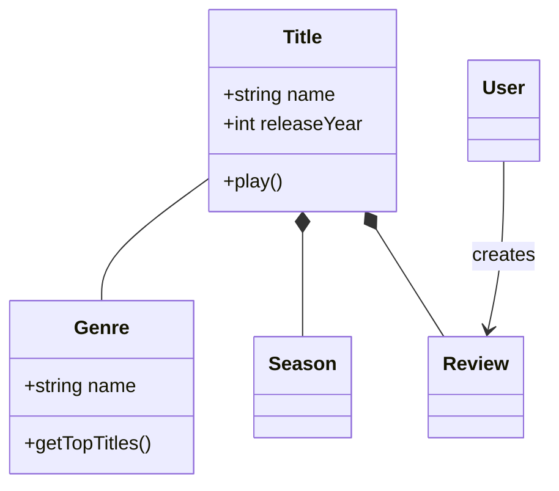
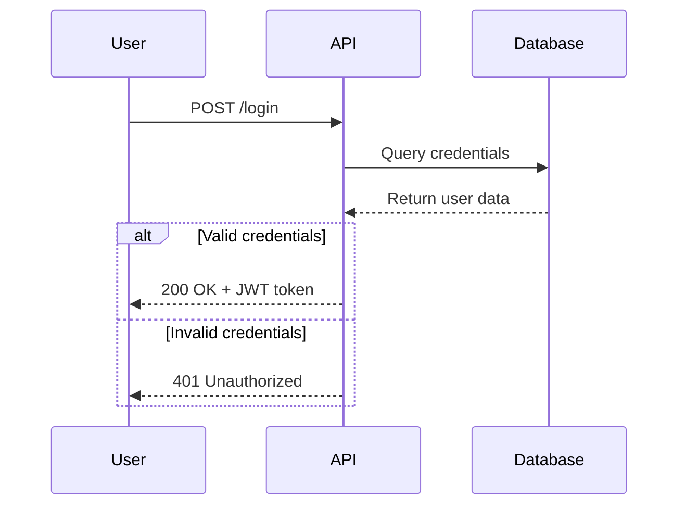
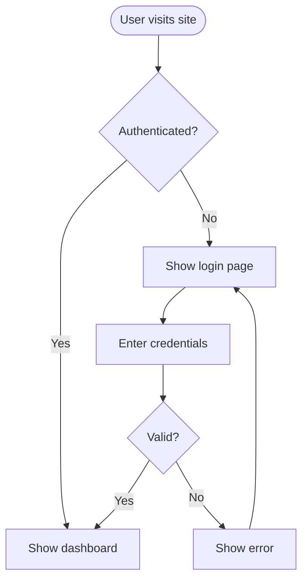
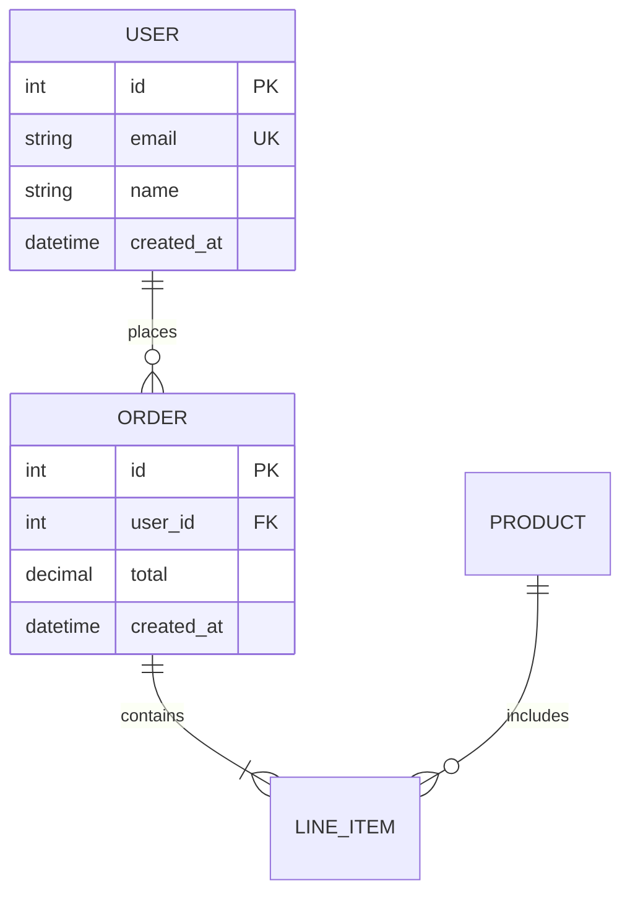
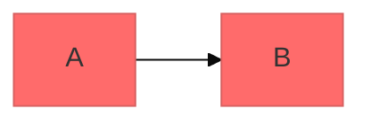

# Mermaid Diagramming

Create professional software diagrams using Mermaid's text-based syntax. Mermaid renders diagrams from simple text definitions, making diagrams version-controllable, easy to update, and maintainable alongside code.

## Workflow

When this skill is invoked:

1. **Clarify Intent** - Ask what the user wants to visualize if unclear
2. **Select Diagram Type** - Use the Decision Tree below
3. **Gather Requirements** - Identify entities, relationships, or flow steps
4. **Create Diagram** - Generate Mermaid syntax following best practices
5. **Refine** - Iterate based on feedback

## Decision Tree: Choosing Diagram Type

```
What do you want to visualize?
│
├── Data relationships / Database schema
│   └── ERD (Entity Relationship Diagram)
│
├── Object-oriented classes / Domain model
│   └── Class Diagram
│
├── Message flow over time / API interactions
│   └── Sequence Diagram
│
├── Process / Algorithm / Decision logic
│   └── Flowchart
│
├── Software architecture / System overview
│   └── C4 Diagram (Context → Container → Component)
│
├── State machine / Lifecycle transitions
│   └── State Diagram
│
├── Git branching strategy
│   └── Git Graph
│
├── Project timeline / Schedule
│   └── Gantt Chart
│
└── Data distribution / Statistics
    └── Pie or Bar Chart
```

## Quick Selection Table

| User Says | Diagram Type | Reference |
|-----------|--------------|-----------|
| "database schema", "tables", "ERD" | `erDiagram` | erd-diagrams.md |
| "class", "domain model", "OOP" | `classDiagram` | class-diagrams.md |
| "API flow", "request/response", "interaction" | `sequenceDiagram` | sequence-diagrams.md |
| "process", "workflow", "flowchart" | `flowchart` | flowcharts.md |
| "architecture", "system context" | C4 Diagram | c4-diagrams.md |
| "states", "lifecycle", "transitions" | `stateDiagram-v2` | advanced-features.md |
| "git branches", "merge strategy" | `gitGraph` | advanced-features.md |
| "timeline", "schedule", "gantt" | `gantt` | advanced-features.md |

## When NOT to Use

Delegate to specialized skills:
- **Software architecture (C4 model)** → Use `c4-architecture` skill
- **Database schema design** → Use `database-schema-designer` skill
- **API design patterns** → Use `api-patterns` skill

## Core Syntax Structure

All Mermaid diagrams follow this pattern:

```mermaid
diagramType
  definition content
```

**Key principles:**
- First line declares diagram type (e.g., `classDiagram`, `sequenceDiagram`, `flowchart`)
- Use `%%` for comments
- Line breaks and indentation improve readability but aren't required
- Unknown words break diagrams; parameters fail silently

## Quick Start Examples

### Class Diagram (Domain Model)


### Sequence Diagram (API Flow)


### Flowchart (User Journey)


### ERD (Database Schema)


## Detailed References

For in-depth guidance on specific diagram types, see:

- **[references/class-diagrams.md](references/class-diagrams.md)** - Domain modeling, relationships (association, composition, aggregation, inheritance), multiplicity, methods/properties
- **[references/sequence-diagrams.md](references/sequence-diagrams.md)** - Actors, participants, messages (sync/async), activations, loops, alt/opt/par blocks, notes
- **[references/flowcharts.md](references/flowcharts.md)** - Node shapes, connections, decision logic, subgraphs, styling
- **[references/erd-diagrams.md](references/erd-diagrams.md)** - Entities, relationships, cardinality, keys, attributes
- **[references/c4-diagrams.md](references/c4-diagrams.md)** - System context, container, component diagrams, boundaries
- **[references/advanced-features.md](references/advanced-features.md)** - Themes, styling, configuration, layout options

## Best Practices

1. **Start Simple** - Begin with core entities/components, add details incrementally
2. **Use Meaningful Names** - Clear labels make diagrams self-documenting
3. **Comment Extensively** - Use `%%` comments to explain complex relationships
4. **Keep Focused** - One diagram per concept; split large diagrams into multiple focused views
5. **Version Control** - Store `.mmd` files alongside code for easy updates
6. **Add Context** - Include titles and notes to explain diagram purpose
7. **Iterate** - Refine diagrams as understanding evolves

## Configuration and Theming

Configure diagrams using frontmatter:



**Available themes:** default, forest, dark, neutral, base

**Layout options:**
- `layout: dagre` (default) - Classic balanced layout
- `layout: elk` - Advanced layout for complex diagrams (requires integration)

**Look options:**
- `look: classic` - Traditional Mermaid style
- `look: handDrawn` - Sketch-like appearance

## Exporting and Rendering

**Native support in:**
- GitHub/GitLab - Automatically renders in Markdown
- VS Code - With Markdown Mermaid extension
- Notion, Obsidian, Confluence - Built-in support

**Export options:**
- [Mermaid Live Editor](https://mermaid.live) - Online editor with PNG/SVG export
- Mermaid CLI - `npm install -g @mermaid-js/mermaid-cli` then `mmdc -i input.mmd -o output.png`
- Docker - `docker run --rm -v $(pwd):/data minlag/mermaid-cli -i /data/input.mmd -o /data/output.png`

## Common Pitfalls

- **Breaking characters** - Avoid `{}` in comments, use proper escape sequences for special characters
- **Syntax errors** - Misspellings break diagrams; validate syntax in Mermaid Live
- **Overcomplexity** - Split complex diagrams into multiple focused views
- **Missing relationships** - Document all important connections between entities

## When to Create Diagrams

**Always diagram when:**
- Starting new projects or features
- Documenting complex systems
- Explaining architecture decisions
- Designing database schemas
- Planning refactoring efforts
- Onboarding new team members

**Use diagrams to:**
- Align stakeholders on technical decisions
- Document domain models collaboratively
- Visualize data flows and system interactions
- Plan before coding
- Create living documentation that evolves with code
