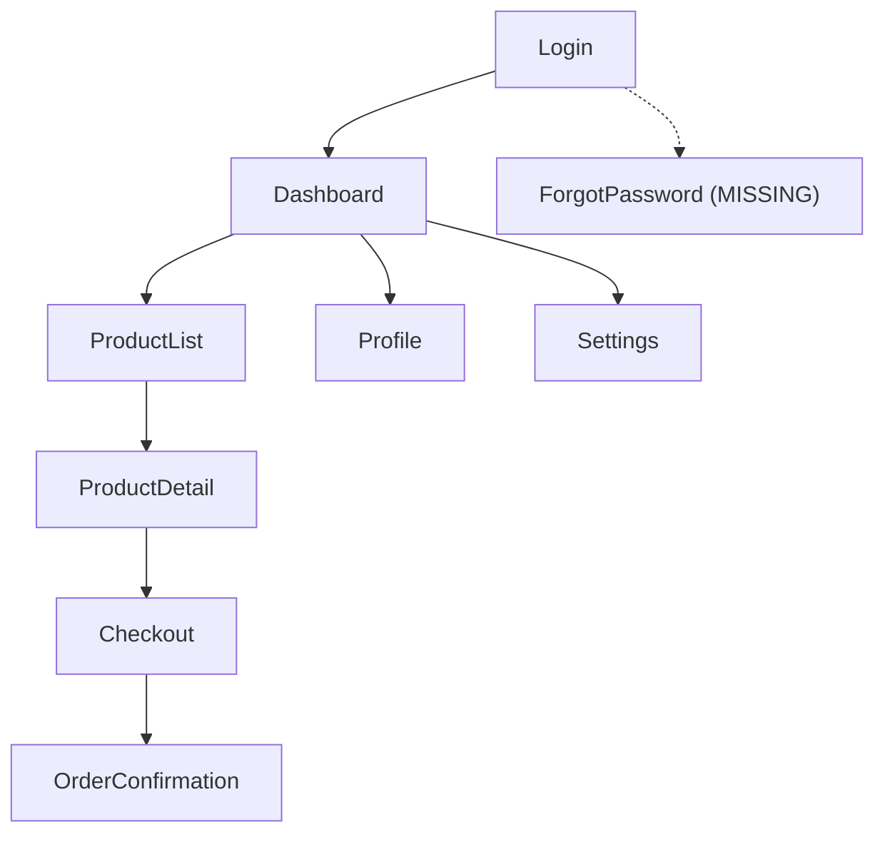

# Stage 3 — Gap & Completeness Analysis (Coordinator)

> Dispatches `handoff-gap-analyzer` agent with ALL prepared screens.
> Agent uses figma-console MCP for all structural and design system analysis (live Plugin API state).
> Produces `design-handoff/gap-report.md` consumed by Stage 3J (judge) and Stage 4 (designer dialog).

## Purpose

Stage 3 is the foundation of **Track B** (supplement generation). It answers two questions:

1. **Part A — Gap Detection**: What does the Figma file show visually but NOT convey behaviorally? A coding agent can extract layouts, colors, and spacing from Figma metadata and screenshots. But it CANNOT know what API a Submit button calls, what happens when a network request fails, or how long a loading animation plays. These invisible requirements are gaps.

2. **Part B — Completeness Detection**: What SHOULD exist in the Figma file but does NOT? A Login screen with a "Forgot Password" link implies a ForgotPassword screen must exist. A list screen implies empty, loading, and error states must exist. Missing screens and states are completeness gaps.

Every gap that Stage 3 misses becomes a silent assumption in implementation. Every missing screen it fails to detect becomes a feature the codebase skips entirely.

---

## Dispatch Protocol

### Prerequisites

Before dispatching the gap analyzer, the coordinator verifies:

```
1. CHECK current_stage in state file == "3"
2. CHECK gap-report.md does NOT already exist (no double-run)
   - IF exists AND stage_3j verdict is "needs_fix": this is a re-run — proceed
3. CHECK handoff-manifest.md EXISTS (produced by Stage 2)
   - QUICK MODE EXCEPTION: Skip this check. In Quick mode, Stage 2 was skipped and no manifest exists.
     Set MANIFEST_PATH = null in dispatch variables.
4. CHECK at least one screen has status == "prepared" OR workflow_mode == "quick" in state file
   - In Quick mode, the single selected screen has status "pending" (not "prepared") — treat it as the analysis target.
   - IF zero prepared screens AND NOT quick mode: HALT — log error, set current_stage back to "2"
```

### Dispatch Prompt

```
Analyze ALL prepared screens for gaps and missing items.

Working directory: {WORKING_DIR}
State file: {STATE_FILE_PATH}
Manifest: {MANIFEST_PATH}

Screen inventory (from state file):
{SCREEN_INVENTORY}

Judge re-run context (if applicable):
{JUDGE_FINDINGS_OR_NULL}

Instructions: Read @$CLAUDE_PLUGIN_ROOT/agents/handoff-gap-analyzer.md
```

| Variable | Source | Fallback |
|----------|--------|----------|
| `{WORKING_DIR}` | State file `artifacts.working_dir` | `design-handoff/` |
| `{STATE_FILE_PATH}` | Known path | `design-handoff/.handoff-state.local.md` |
| `{MANIFEST_PATH}` | State file `artifacts.handoff_manifest` | `design-handoff/handoff-manifest.md` |
| `{SCREEN_INVENTORY}` | State file `screens[]` filtered to `status == "prepared"` | N/A (required) |
| `{JUDGE_FINDINGS_OR_NULL}` | `judge_verdicts.stage_3j.findings` if re-run | `"First run — no prior findings"` |

---

## Part A: Gap Detection

### Per-Screen Analysis via figma-console

The gap analyzer uses BOTH Figma MCP servers on each screen. This is not redundant — they reveal different information:

| Tool | What It Reveals |
|------|-----------------|
| `figma_get_file_for_plugin(depth=figma.query_depth)` | Layer tree (element names, types, hierarchy). This tells the analyzer what IS expressed structurally — prototype connections, node types, nesting. |
| `figma_get_component_for_development` | CSS specs (colors, spacing, typography, auto-layout, constraints). Design-to-code optimized response. |
| `figma_get_component_details` | Component variant definitions (revealing missing states), available properties, current variant selections. |
| `figma_search_components` | Instance spread patterns, shared component usage across screens. |
| `figma_get_styles` | Style consistency (outliers), style definitions. |
| `figma_get_variables` | Token/variable bindings (revealing theming gaps), design system health. |

> **Screenshot rule**: Per SKILL.md Rules 8 and 10.

**figma-console reveals all dimensions:** structural (what IS in the file) and design system patterns that IMPLY what should be there but is missing (e.g., a component with only `default` and `hover` variants — meaning `disabled`, `loading`, and `error` variants are missing states).

### Gap Categories

The analyzer checks each screen against 6 categories (from `gap_analysis.categories` in config). Every gap is something a coding agent CANNOT derive from Figma alone.

#### 1. Behaviors
What happens when a user interacts with an element? Figma shows static frames, not behavioral outcomes.

#### 2. States
Which UI states exist but are not shown as separate frames or component variants?

#### 3. Animations
Micro-interactions, gesture-driven animations, and transition specifications that Figma prototyping cannot fully express.

#### 4. Data
API calls, payloads, response shapes, dynamic content sources, and real-time update behavior.

#### 5. Logic
Business rules, permission gates, conditional rendering, A/B variations, and feature flags.

#### 6. Edge Cases
Boundary conditions, failure modes, and concurrent action scenarios.

> **Calibration examples:** For concrete examples of each gap category (what to look for, typical screens, example gaps), load `@$CLAUDE_PLUGIN_ROOT/skills/design-handoff/references/gap-category-examples.md` in the agent dispatch prompt. Do NOT load into coordinator context.

### Severity Classification

Every gap gets exactly one severity level. Canonical definitions are in `gap_analysis.severity_levels` in config. Decision test per level:

| Severity | Decision Test |
|----------|---------------|
| `CRITICAL` | "If the coding agent guesses, will the feature be fundamentally broken?" |
| `IMPORTANT` | "If the coding agent uses a platform default, will it look/feel wrong but still work?" |
| `NICE_TO_HAVE` | "If this is missing at launch, will any user notice on day one?" |

### Confidence Tagging

Every gap also gets a confidence level indicating how certain the analyzer is that this IS a genuine gap:

| Confidence | Meaning | Example |
|------------|---------|---------|
| `high` | Definitively missing — no mention anywhere in Figma structure or prototype connections | Button has no prototype connection and no component variant for its action |
| `medium` | Likely missing — may be partially addressed by a global handler or implicit pattern | Error handling that might be covered by a cross-screen pattern but is not explicit |
| `low` | Possibly covered — evidence is ambiguous, may be addressed by conventions not visible in Figma | Edge case that standard platform behavior may handle |

Confidence never overrides severity — a `low`-confidence `CRITICAL` gap remains CRITICAL. Confidence is used for: (1) sort order within severity tiers (high-confidence surfaces first), (2) deduplication in cross-screen synthesis (merged findings take higher confidence).

---

## Part B: Completeness Detection

### Missing Screen Identification

The analyzer traces EVERY interactive element on every screen to determine its implied destination:

```
FOR EACH screen in inventory:
  FOR EACH interactive element (button, link, card, tab, nav item, icon):
    1. Check prototype connections (figma_get_file_for_plugin with depth=figma.query_depth)
       - Connection exists + destination in inventory → OK
       - Connection exists + destination NOT in inventory → MISSING SCREEN
    2. Check text content for implied navigation
       - "Forgot Password", "View Details", "Settings", "See All" → implied destination
       - IF destination screen NOT in inventory → MISSING SCREEN
    3. Check icon semantics for implied navigation
       - Arrow, chevron, external-link, plus icon → implied destination
       - IF no matching screen in inventory → MISSING SCREEN
```

**Common sources of missing screens:**

| Source Element | Implied Screen | Why It's Often Missing |
|---------------|---------------|----------------------|
| "Forgot Password" link on Login | Password Reset flow (email entry, code verification, new password) | Designers focus on happy path first |
| "View All" link on Dashboard | Full list screen with filters/sorting | Dashboard designed in isolation |
| Error state trigger (failed API call) | Error screen or error state variant | Only success path is designed |
| Notification badge on tab bar | Notifications list screen | Badge is decorative in mockup |
| "Edit Profile" button | Profile editing form | Detail screens designed before edit variants |
| Back/close button on a modal | Previous screen's post-modal state | Modal designed forward, not backward |

### Missing State Identification

The analyzer uses screen type heuristics to determine EXPECTED states, then checks which are actually present:

| Screen Type | Expected States | Detection Method |
|-------------|----------------|-----------------|
| **List screen** | empty, loading, error, partial-load, end-of-list | Check for frames named `*-empty`, `*-loading`, `*-error`. Check component variants via `figma_get_component_details`. |
| **Form screen** | pristine, dirty, validating, submitting, success, error, field-level-errors | Check for error state frames. Check input component variants for error/disabled/focus states. |
| **Detail screen** | loading, loaded, error, not-found (404) | Check for skeleton/loading frames. Check for error variants. |
| **Auth screen** | default, loading, error, success, rate-limited, locked | Check for error message areas. Check button component variants. |
| **Dashboard** | loading, loaded, partial-data, stale-data, error | Check for skeleton states. Check card component variants. |
| **Settings** | default, saving, saved-confirmation, error | Check for inline feedback elements. |

**figma-console is essential here:** `figma_get_component_details` reveals which variants a component defines. If a `TextInput` component has variants `[default, focused, filled]` but NOT `[error, disabled]`, those are missing states that affect every screen using that component.

### Classification

Every missing screen or state gets exactly one classification. Canonical definitions are in `gap_analysis.missing_screen_classifications` in config. Decision test per level:

| Classification | Decision Test |
|---------------|---------------|
| `MUST_CREATE` | "Without this screen, will the coding agent build a dead-end or broken flow?" |
| `SHOULD_CREATE` | "Can the coding agent use a standard platform pattern that will look acceptable?" |
| `OPTIONAL` | "Is a platform-standard UI sufficient, needing only custom copy?" |

---

## Cross-Screen Pattern Extraction

Patterns that appear across multiple screens are extracted once and referenced globally, avoiding redundant per-screen entries.

### Shared Behaviors

```
SCAN all screens for repeated behavioral patterns:

| Pattern Type | What to Look For |
|-------------|-----------------|
| Navigation transitions | Push vs modal vs fade between screen pairs |
| Error handling | Toast vs inline vs dialog — is one pattern used globally? |
| Loading indicators | Skeleton vs spinner vs shimmer — consistent or per-screen? |
| Universal gestures | Pull-to-refresh, swipe-to-dismiss, swipe-to-delete |
| Global states | Offline banner, session timeout, force logout overlay |
| Haptic feedback | Consistent haptic patterns across interactions |
```

### Navigation Model

The analyzer builds a complete navigation graph from prototype connections and implied navigation:

```
OUTPUT FORMAT: mermaid flowchart

Sources:
1. Prototype connections from figma_get_file_for_plugin (depth=figma.query_depth)
2. Implied navigation from interactive element text/icons (Part B)
3. Tab bar / bottom navigation structure
4. Drawer / sidebar menu structure

Rules:
- Every screen in inventory MUST appear as a node
- Missing screens appear as dashed-border nodes
- Edge labels describe trigger ("tap Submit", "swipe left", "tab switch")
- Orphan screens (no incoming or outgoing edges) are flagged
```

### Common Transitions

```
CATALOG transition types used across screen pairs:

| Transition Type | Usage |
|----------------|-------|
| Screen-to-screen | push, pop, modal present, modal dismiss, replace |
| Within-screen | tab switch, accordion expand/collapse, list-to-detail |
| Overlay | bottom sheet, dialog, tooltip, snackbar, dropdown |

NOTE: Figma prototype connections may specify some transitions.
Where not specified, record as "unspecified — designer decision needed."
```

---

## Gap Report Format

The agent writes `{WORKING_DIR}/gap-report.md` in this exact structure:

~~~markdown
---
status: completed | error
total_screens_analyzed: {N}
screens_with_gaps: {N}
screens_no_supplement_needed: {N}
screens_skipped: {N}                  # Screens with status "blocked" — excluded from analysis
total_gaps: {N}
gap_breakdown:
  critical: {N}
  important: {N}
  nice_to_have: {N}
missing_items:
  must_create: {N}
  should_create: {N}
  optional: {N}
cross_screen_patterns: {N}
error_reason: null
---

# Gap & Completeness Report

## Section 1: Per-Screen Gaps

### {ScreenName}

**Node ID:** `{NODE_ID}` | **Gaps:** {N} (C:{N} I:{N} N:{N})

| # | Category | Gap Description | Severity | Confidence | Element / Context |
|---|----------|----------------|----------|------------|-------------------|
| 1 | behaviors | What happens on Submit tap? No API endpoint, success/failure handling, or loading state defined | CRITICAL | high | SubmitButton |
| 2 | states | No error state shown for invalid credentials | CRITICAL | high | LoginForm |
| 3 | animations | Loading indicator animation unspecified — spinner? button morph? duration? | IMPORTANT | medium | SubmitButton |
| 4 | data | Password field — min/max length? complexity requirements? visibility toggle behavior? | IMPORTANT | medium | PasswordInput |
| 5 | edge_cases | Rate limiting after failed attempts — lockout policy? CAPTCHA trigger? | NICE_TO_HAVE | low | LoginForm |

---

### {ScreenName}

**Node ID:** `{NODE_ID}` | **No supplement needed**

---

## Section 2: Missing Screens & States

| # | Missing Item | Type | Classification | Implied By | Rationale |
|---|-------------|------|----------------|------------|-----------|
| 1 | ForgotPassword | screen | MUST_CREATE | Login > "Forgot Password" link | No screen exists for password reset flow — blocks implementation |
| 2 | ProductList-Empty | state | SHOULD_CREATE | ProductList screen type | List screen has no empty state — coding agent needs illustration/CTA reference |
| 3 | PermissionCamera | screen | OPTIONAL | Camera feature implied by profile photo | OS-standard dialog with custom rationale text — supplement description sufficient |

## Section 3: Cross-Screen Patterns

### Shared Behaviors

| Pattern | Applies To | Description | Decision Needed |
|---------|-----------|-------------|-----------------|
| Error handling | All form screens | Inline field errors + summary banner? Or toast only? | Yes — no consistent pattern observed |
| Loading indicator | Dashboard, ProductList, Profile | Skeleton screens? Spinner? Shimmer? | Yes — inconsistent across screens |
| Pull-to-refresh | ProductList, Dashboard | Supported? Custom indicator or platform default? | Yes — no prototype connection |

### Navigation Model



### Common Transitions

| Transition | Used Between | Type | Specified in Figma? |
|------------|-------------|------|---------------------|
| Push right | Login -> Dashboard | screen-to-screen | No |
| Modal present | ProductList -> FilterSheet | overlay | Yes (prototype) |
| Tab switch | Dashboard tabs | within-screen | No |
| Bottom sheet | ProductDetail -> AddToCart | overlay | No |
~~~

---

## "No Supplement Needed" Screens

Not every screen has gaps. Screens where Figma fully expresses the design intent — purely static screens with no interactive elements, no data dependencies, and no missing states — are explicitly marked in Section 1 as:

```markdown
### {ScreenName}

**Node ID:** `{NODE_ID}` | **No supplement needed**
```

This marking is essential. Omitting a screen from Section 1 is ambiguous — it could mean the screen was analyzed and found gap-free, or it could mean the screen was accidentally skipped. The explicit `No supplement needed` marker eliminates that ambiguity.

**Common candidates for zero-gap screens:**
- Static legal/terms pages (content is fixed, no interactions beyond scroll)
- Splash/launch screens (purely visual, no user interaction)
- "About" screens with no interactive elements
- Static onboarding illustration panels (non-interactive)

Even for zero-gap screens, the analyzer must still verify: (1) no interactive elements exist that would imply behaviors, (2) no component instances exist with missing variant states, and (3) no navigation elements exist that would imply missing destination screens.

---

## Self-Verification (Before Writing Final Report)

The gap analyzer MUST run these checks before writing the final `gap-report.md`. This follows the Reflexion pattern — verify internal consistency before handing off to the judge.

```
1. COVERAGE CHECK: Every screen in the inventory must appear in Section 1.
   - Either with gaps listed OR with "No supplement needed" marker.
   - IF any screen is absent: add it with appropriate marking before writing.

2. NAVIGATION COMPLETENESS: Every node in the Section 3 navigation model must
   correspond to either an inventory screen OR a missing screen entry in Section 2.
   - IF orphan nodes exist: investigate — either add as missing screen or remove from graph.

3. SEVERITY PLAUSIBILITY:
   - IF scenario == "draft_to_handoff" AND total CRITICAL gaps == 0: flag for re-examination
     (draft scenarios almost always have behavioral gaps).
   - IF a form-type screen has zero "behaviors" gaps: flag as suspicious — forms always have
     submission, validation, and error handling behaviors.

4. CROSS-REFERENCE INTEGRITY: Every missing screen in Section 2 must have an `implied_by`
   that references an element on an actual inventory screen.
   - IF any missing screen has no valid `implied_by`: remove or re-attribute.
```

If any check fails, the analyzer corrects the report before writing. Corrections are logged in the gap report frontmatter as `self_verification_corrections: [{check, correction}]`.

---

## Transition to Stage 3J

After the gap analyzer writes `gap-report.md`, the orchestrator verifies the output before dispatching the judge:

```
1. READ gap-report.md
2. VERIFY frontmatter status == "completed"
   - IF status == "error": log error_reason, HALT workflow, notify designer
3. VERIFY total_screens_analyzed == count of screens with status "prepared" in state file
   - IF mismatch: log warning — some prepared screens were not analyzed
4. UPDATE state file:
   - Set gap counts per screen (gap_count.critical, gap_count.important, gap_count.nice_to_have)
   - Set missing_screens[] from Section 2
   - Set patterns from Section 3
   - Set artifacts.gap_report path
5. GENERATE figma-screen-briefs/ for actionable missing items:
   > FSB directory: read from `directories.figma_screen_briefs` in `@$CLAUDE_PLUGIN_ROOT/config/handoff-config.yaml`
   > (default: `"design-handoff/figma-screen-briefs"`). Never hardcode this path.
   ```
   FOR EACH missing_screen in GAP_REPORT Section 2
     WHERE classification IN ("MUST_CREATE", "SHOULD_CREATE"):

     1. Determine FSB number: count existing FSB-*.md files in {FSB_DIR}/ + 1
        where {FSB_DIR} = directories.figma_screen_briefs from config
     2. Determine reference_screen_node_id:
        - IF implied_by references a specific screen: use that screen's node_id from state
        - ELSE: use the screen with the highest composite readiness score
          formula: `(readiness_score.naming + readiness_score.tokens + readiness_score.structure) / 3`
          ties broken by earliest position in state file `screens[]` inventory
     3. Read template: @$CLAUDE_PLUGIN_ROOT/templates/figma-screen-brief-template.md
     4. Populate and write: {FSB_DIR}/FSB-{NNN}-{ScreenName}.md
        - id: FSB-{NNN}
        - name: {missing_screen.name}
        - status: pending
        - trigger: "design-handoff"
        - source: "Gap report Section 2 — {missing_screen.implied_by}"
        - figma_node_id: null
        - Context.Entry: derived from implied_by element and source screen
        - Context.Exit: inferred from screen type (state variant stays on same screen; new screen navigates forward)
        - Context.Classification: {missing_screen.classification}
        - Context.Reference_screen: closest existing screen node_id
        - Layout: inferred from screen type + classification reason (1-3 sentences, no colors/spacing)
        - States: derived from gap_analysis.categories["states"] findings for this screen
        - Behaviors: derived from gap_analysis.categories["behaviors"] findings for this screen
        - Content: placeholder labels — orchestrator fills what's inferable from screen name/purpose
        - Figma Components: leave as placeholder — handoff-figma-preparer fills via figma_search_components
        - figma-console Notes: "Clone structure from reference screen: nodeId: {REF_NODE_ID}"
   ```
   Update state file: set `artifacts.figma_screen_briefs_dir: "{FSB_DIR}"` (value from config key)
   and `figma_screen_briefs_count: {N}`.
6. DISPATCH handoff-judge with checkpoint stage_3j
   - See references/judge-protocol.md > Stage 3J rubric
7. ON judge verdict:
   - PASS → check if missing_screens contains MUST_CREATE or SHOULD_CREATE items
     - IF yes → advance to Stage 3.5 (Design Extension)
     - IF no → advance to Stage 4 (Designer Dialog)
   - NEEDS_FIX (fix_type: re_examine) → re-dispatch handoff-gap-analyzer with judge findings
     - Max cycles: judge.checkpoints.stage_3j.max_review_cycles from config
```
