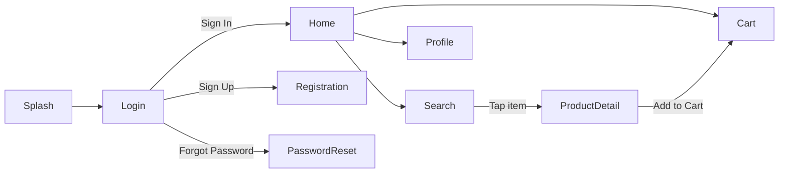
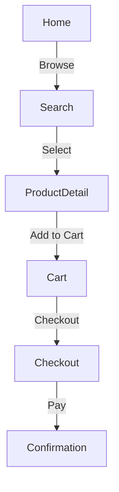
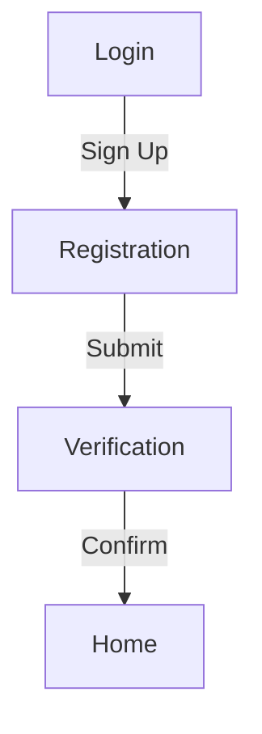
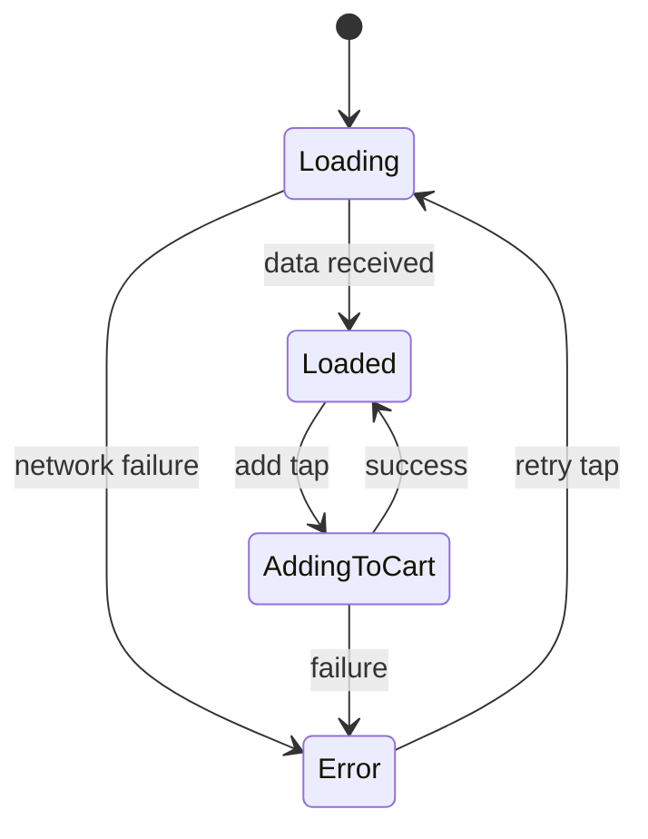

# Coherence Check Protocol (Stage 3)

> Orchestrator dispatches the `narration-coherence-auditor` agent to perform cross-screen consistency analysis.
> The auditor reads ALL completed screen narratives and returns structured findings.

## CRITICAL RULES (must follow)

1. **Dispatch to dedicated agent**: Use `narration-coherence-auditor` — do NOT run inline (context-heavy with multiple files).
2. **All inconsistencies go through user**: Never auto-fix inconsistencies. Present each to user for confirmation.
3. **Generate mermaid diagrams**: Navigation map + user journey flows + state machine diagrams are MANDATORY outputs.

---

## Dispatch Template

```
Task(subagent_type="general-purpose", prompt="""
Read and follow the instructions in @$CLAUDE_PLUGIN_ROOT/agents/narration-coherence-auditor.md

## Input
- Screens directory: design-narration/screens/
- Screen files: {LIST_OF_SCREEN_FILES}
- Accumulated patterns: {PATTERNS_YAML}
- State file: design-narration/.narration-state.local.md

## Output
Write findings to: design-narration/coherence-report.md
""")
```

---

## Auditor Output Format

The coherence auditor writes `design-narration/coherence-report.md`:

```yaml
---
status: completed
inconsistencies_found: {N}
patterns_extracted:
  shared_components: {N}
  interaction_conventions: {N}
  naming_patterns: {N}
mermaid_diagrams_generated: {N}
---
```

Followed by markdown body with:

### Section 1: Inconsistencies

```markdown
## Inconsistencies

| # | Check | Screen A | Screen B | Issue | Suggested Fix |
|---|-------|----------|----------|-------|---------------|
| 1 | naming | Login | Home | "Header" vs "Top Bar" | Standardize to "Header Bar" |
| 2 | state_parity | Search | Orders | Orders missing loading state | Add loading state |
```

### Section 2: Extracted Patterns

Shared components table, interaction conventions table, naming patterns.

### Section 3: Mermaid Diagrams

#### Navigation Map

```markdown
## Navigation Map


```

#### User Journey Flows

One mermaid diagram per key user task identified from navigation tables:

```markdown
## User Journeys

### Purchase Flow


### Registration Flow

```

#### State Machine Diagrams

For screens with 4+ states:

```markdown
## State Machines

### Product Detail Screen

```

---

## Orchestrator: Handle Inconsistencies

After receiving the coherence report:

```
READ coherence-report.md

IF inconsistencies_found == 0:
    NOTIFY user: "Cross-screen coherence check passed. No inconsistencies found."
    ADVANCE to Stage 4

IF inconsistencies_found > 0:
    FOR each inconsistency (batch of up to 4 via AskUserQuestion):
        PRESENT:
            question: "[{CHECK_TYPE}] {ISSUE_DESCRIPTION}
            Screen A ({SCREEN_A}): {VALUE_A}
            Screen B ({SCREEN_B}): {VALUE_B}"

            options:
              - "{SUGGESTED_FIX} (Recommended)"
              - "Keep Screen A version"
              - "Keep Screen B version"
              - "Let's discuss this"

        RECORD answer
        UPDATE affected screen narrative files
        ADD to decision audit trail (with revision_reason: "coherence check")

    UPDATE state:
        coherence.status: completed
        coherence.inconsistencies_found: {N}
        coherence.inconsistencies_resolved: {resolved_count}
```

---

## Orchestrator: Extract Final Patterns

After coherence resolution:

1. Read shared components from coherence report → update state patterns
2. Read interaction conventions → update state patterns
3. These final patterns will be included in Global Patterns section of UX-NARRATIVE.md

---

## Orchestrator: Update Mermaid Diagrams

The mermaid diagrams from the coherence report are stored for inclusion in Stage 5 output:

1. Navigation map → Global Patterns section
2. User journey flows → Global Patterns section
3. State machine diagrams → State Machine Diagrams section (end of document)

If any screen narratives were updated during inconsistency resolution, verify that the navigation map still reflects the latest navigation tables.

---

## Self-Verification

Before advancing to Stage 4:

1. `design-narration/coherence-report.md` exists with populated YAML frontmatter
2. All inconsistencies presented to user (none silently skipped)
3. Updated screen files are consistent with user decisions
4. Mermaid diagrams generated (at least navigation map)
5. State file coherence section updated

## CRITICAL RULES REMINDER

1. Dispatch to dedicated agent — do NOT run inline
2. All inconsistencies go through user
3. Mermaid diagrams are MANDATORY
