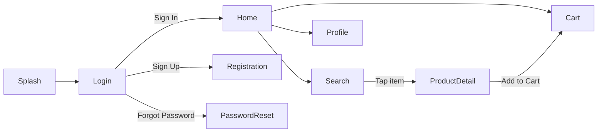
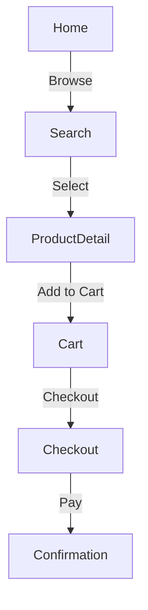
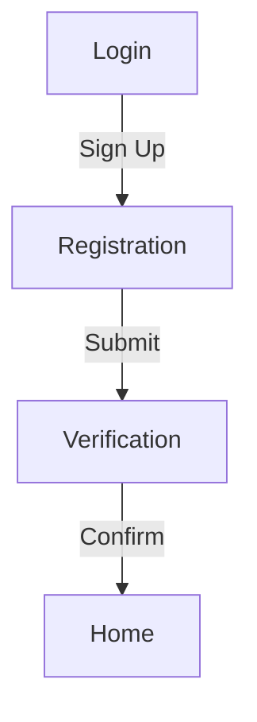
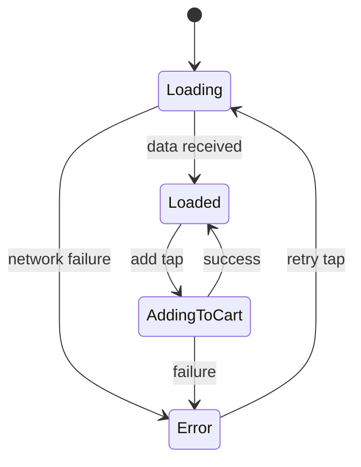

# Coherence Check Protocol (Stage 3)

> Orchestrator dispatches the `narration-coherence-auditor` agent to perform cross-screen consistency analysis.
> The auditor reads ALL completed screen narratives and returns structured findings.

## CRITICAL RULES (must follow)

1. **Dispatch to dedicated agent**: Use `narration-coherence-auditor` — do NOT run inline (context-heavy with multiple files).
2. **All inconsistencies go through user**: Never auto-fix inconsistencies. Present each to user for confirmation.
3. **Generate mermaid diagrams**: Navigation map + user journey flows + state machine diagrams are MANDATORY outputs.

---

## Large Screen Set Handling

When screen count exceeds `coherence.max_screens_per_dispatch` (from config), two strategies are available:

1. **Clink Pathway (preferred for large sets)**: Use `mcp__pal__clink` with Gemini CLI (1M context) to analyze all full narrative files at once — no digest compression needed.
2. **Digest-first (fallback)**: Compress each screen to a few-line digest, auditor reads full files only for flagged screens.

### Clink Pathway (Large Screen Sets via Gemini)

> **Why Gemini for coherence:** Cross-screen coherence requires reading ALL narrative files
> simultaneously (~120-200 lines each). Gemini's 1M context window can hold 20+ full
> narrative files without digest compression, unlike Codex (used for validation) which
> is code-specialized but has a smaller effective context for prose-heavy analysis.

When `clink_enabled == true` AND `screen_count > clink_threshold` AND `mcp__pal__clink` tool is available:

```
READ config: coherence.clink_enabled
READ config: coherence.clink_threshold
READ config: coherence.clink_cli
READ config: coherence.clink_timeout_seconds
READ config: coherence.clink_model
READ config: coherence.clink_use_thinking

IF screen_count > clink_threshold AND clink_enabled:
    # Verify clink tool availability
    CHECK: mcp__pal__clink is available in current tool set

    IF available:
        # Compile full file paths for ALL screen narratives
        SET narrative_paths = []
        FOR each screen in state.screens[] WHERE status IN ["described", "signed_off"]:
            APPEND absolute path of "design-narration/screens/{nodeId}-{name}.md" to narrative_paths

        # Also include accumulated patterns for baseline context
        SET patterns_yaml = state.patterns (compiled to YAML string)

        # Dispatch via clink with explicit model and reasoning instructions
        CALL mcp__pal__clink:
            cli_name: "{clink_cli}"  # "gemini" from config
            model: "{clink_model}"   # "gemini-2.5-pro" — prevents auto-routing to flash-lite
            absolute_file_paths: narrative_paths
            prompt: |
                You are a Cross-Screen Coherence Auditor for UX narrative documents.
                You have been given {screen_count} screen narrative files. Each file describes
                a single app screen with its purpose, elements, behaviors, states, and navigation.

                ## Reasoning Instructions

                This is a complex multi-document analysis task. Think step by step.
                For each consistency check, first list all screens that could be affected,
                then compare them systematically. Do not skip screens or checks.

                ## Your Task

                Perform 5 consistency checks across ALL screens.
                (These checks mirror `coherence_checks` in narration-config.yaml.
                If the config adds/removes checks, update this prompt to match.)

                1. **Naming Consistency**: Same UI element must use the same name across all screens.
                   Flag: element called "Header" in one screen and "Top Bar" in another.

                2. **Interaction Consistency**: Same gesture must produce the same outcome on
                   equivalent elements. Flag: long-press shows tooltip on Screen A but context
                   menu on Screen B for the same element type.

                3. **Navigation Completeness**: Every exit point on Screen A must have a matching
                   entry point on Screen B. Flag: "Tap Settings" navigates to Settings screen,
                   but Settings screen has no "Back to {origin}" path.

                4. **State Coverage Parity**: Screens sharing data must show consistent
                   empty/error/loading states. Flag: Product List has loading state but
                   Order History (same data pattern) does not.

                5. **Terminology Drift**: Domain terms must be uniform. Flag: "cart" vs "basket"
                   or "order" vs "purchase" used interchangeably.

                ## Patterns Baseline

                These patterns have been accumulated during screen analysis:
                ```yaml
                {patterns_yaml}
                ```

                ## Required Output Format

                Write your complete output as a markdown document with YAML frontmatter.

                ### YAML Frontmatter (MANDATORY):
                ```yaml
                ---
                status: completed
                inconsistencies_found: {N}
                patterns_extracted:
                  shared_components: {N}
                  interaction_conventions: {N}
                  naming_patterns: {N}
                mermaid_diagrams_generated: {N}
                ---
                ```

                ### Section 1: Inconsistencies
                Table: | # | Check | Screen A | Screen B | Issue | Suggested Fix |

                ### Section 2: Extracted Patterns
                - Shared components table
                - Interaction conventions table
                - Naming patterns table

                ### Section 3: Mermaid Diagrams (MANDATORY)
                Generate ALL of these:
                1. **Navigation Map**: `graph LR` showing all screen-to-screen transitions
                2. **User Journey Flows**: One `graph TD` per key user task
                3. **State Machine Diagrams**: `stateDiagram-v2` for screens with 4+ states

                Mermaid validation rules:
                - No spaces in node IDs (use `ProductDetail` not `Product Detail`)
                - All edge labels in double quotes (`|"label"|`)
                - Every referenced node must be declared
                - Node IDs must match screen names from narrative files

                ## Example Output (abbreviated)

                ---
                status: completed
                inconsistencies_found: 2
                patterns_extracted:
                  shared_components: 3
                  interaction_conventions: 2
                  naming_patterns: 1
                mermaid_diagrams_generated: 3
                ---

                ## Inconsistencies

                | # | Check | Screen A | Screen B | Issue | Suggested Fix |
                |---|-------|----------|----------|-------|---------------|
                | 1 | naming_consistency | Home | Search | "Navigation Bar" vs "Nav Bar" | Standardize to "Navigation Bar" |
                | 2 | state_coverage_parity | ProductList | OrderHistory | OrderHistory missing loading state | Add loading skeleton matching ProductList |

                ## Extracted Patterns
                [tables...]

                ## Mermaid Diagrams

                ### Navigation Map
                ```mermaid
                graph LR
                    Home -->|"Search"| Search
                    Home -->|"Profile"| Profile
                    Search -->|"Select"| ProductDetail
                ```

                ### Purchase Journey
                ```mermaid
                graph TD
                    Home -->|"Browse"| Search
                    Search -->|"Select"| ProductDetail
                    ProductDetail -->|"Add"| Cart
                ```

                Write ONLY the markdown document. No preamble, no commentary.

        # Verify output
        IF clink returned successfully:
            # Clink output is the coherence report content
            WRITE clink output to: design-narration/coherence-report.md

            # Validate the written file
            READ design-narration/coherence-report.md (limit=20)
            PARSE YAML frontmatter
            IF frontmatter.status == "completed" AND frontmatter has required fields:
                LOG: "Clink coherence check completed via Gemini CLI"
                # Continue to "Orchestrator: Handle Inconsistencies" below
            ELSE:
                LOG WARNING: "Clink output has malformed frontmatter — falling back to digest-first"
                DELETE design-narration/coherence-report.md
                GOTO digest-first strategy below

        ELSE (clink error):
            LOG DEGRADED: "Clink coherence failed — falling back to digest-first"
            GOTO digest-first strategy below

    IF NOT available (mcp__pal__clink not in tool set):
        LOG DEGRADED: "Clink tool unavailable — falling back to digest-first"
        GOTO digest-first strategy below
```

### Digest-First Strategy (Fallback for Large Screen Sets)

When clink is unavailable/disabled/failed, OR `coherence.large_set_strategy == "digest-first"`:

```
IF screen_count > coherence.max_screens_per_dispatch:
    # Digest-first strategy
    COMPILE per-screen digest (coherence.per_screen_digest_lines per screen):
        "{SCREEN_NAME} | Score: {TOTAL}/20 | Patterns: {top 3 patterns} | Nav: {entry→exit}"

    DISPATCH coherence auditor with DIGEST instead of full screen files
    INCLUDE instruction: "Read full narrative file ONLY for screens you flag for inconsistency"

    # Auditor returns which screens need full-file comparison
    FOR each flagged screen pair:
        VERIFY auditor read the full files before finalizing the inconsistency finding

ELSE:
    DISPATCH with full screen files (standard path below)
```

---

## Dispatch Template

```
Task(subagent_type="general-purpose", prompt="""
You are a coordinator for Design Narration, Stage 3 (Coherence Check).
You MUST NOT interact with users directly. Write all output to files.
You MUST write the coherence report upon completion.

Read and execute the instructions in @$CLAUDE_PLUGIN_ROOT/agents/narration-coherence-auditor.md

## Reasoning
For complex cross-screen analysis, use `mcp__sequential-thinking__sequentialthinking` if available
to structure your comparison systematically across all screens before writing findings.

## Input
- Screens directory: design-narration/screens/
- Screen files: {LIST_OF_SCREEN_FILES}
- Accumulated patterns: {PATTERNS_YAML}
- State file: design-narration/.narration-state.local.md

## Output
Write findings to: design-narration/coherence-report.md
""")
```

---

## Auditor Output Format

The coherence auditor writes `design-narration/coherence-report.md`:

```yaml
---
status: completed
inconsistencies_found: {N}
patterns_extracted:
  shared_components: {N}
  interaction_conventions: {N}
  naming_patterns: {N}
mermaid_diagrams_generated: {N}
---
```

Followed by markdown body with:

### Section 1: Inconsistencies

```markdown
## Inconsistencies

| # | Check | Screen A | Screen B | Issue | Suggested Fix |
|---|-------|----------|----------|-------|---------------|
| 1 | naming | Login | Home | "Header" vs "Top Bar" | Standardize to "Header Bar" |
| 2 | state_parity | Search | Orders | Orders missing loading state | Add loading state |
```

### Section 2: Extracted Patterns

Shared components table, interaction conventions table, naming patterns.

### Section 3: Mermaid Diagrams

#### Navigation Map

<details>
<summary>Navigation Map mermaid example (skip if familiar)</summary>

## Navigation Map



</details>

#### User Journey Flows

One mermaid diagram per key user task identified from navigation tables.

<details>
<summary>User Journey mermaid examples (skip if familiar)</summary>

## User Journeys

### Purchase Flow



### Registration Flow



</details>

#### State Machine Diagrams

For screens with 4+ states.

<details>
<summary>State Machine mermaid example (skip if familiar)</summary>

## State Machines

### Product Detail Screen



</details>

#### Mermaid Validation Checklist (MANDATORY)

Before finalizing any mermaid diagram, verify:

| Check | Rule |
|-------|------|
| Valid node IDs | No spaces or special characters in node identifiers (use `ProductDetail` not `Product Detail`) |
| Quoted edge labels | All edge labels wrapped in double quotes (`\|"label"\|`) |
| No orphan references | Every node referenced in an edge exists as a declared node |
| Consistent naming | Node IDs match screen names used in narrative files |
| Render test | Mentally trace the diagram — every path from entry reaches at least one exit |

---

## Orchestrator: Auto-Resolve Gate (Inconsistencies)

Before presenting inconsistencies to user, run the auto-resolve gate to filter out
inconsistencies where the resolution is already implicit in prior answers or patterns.
See `references/auto-resolve-protocol.md` for full logic.

```
READ coherence-report.md

IF inconsistencies_found > 0:
    # Convert inconsistencies to question format for auto-resolve gate
    SET pending_questions = []
    FOR each inconsistency:
        CONVERT to question: "{CHECK_TYPE}: {ISSUE_DESCRIPTION} — Screen A ({SCREEN_A}): {VALUE_A} vs Screen B ({SCREEN_B}): {VALUE_B}"
        SET options: [suggested_fix, keep_A, keep_B, discuss]
        APPEND to pending_questions

    # Run auto-resolve gate (per references/auto-resolve-protocol.md)
    RUN auto-resolve gate on pending_questions
    SET user_inconsistencies = returned user_questions[]

    # Update inconsistencies_found to reflect only user-facing ones
    SET user_inconsistencies_count = len(user_inconsistencies)
```

---

## Orchestrator: Handle Inconsistencies

After the auto-resolve gate:

```
IF user_inconsistencies_count == 0 AND inconsistencies_found > 0:
    NOTIFY user: "Cross-screen coherence check found {inconsistencies_found} inconsistencies — all auto-resolved from prior answers/patterns."
    ADVANCE to Stage 4

IF user_inconsistencies_count == 0 AND inconsistencies_found == 0:
    NOTIFY user: "Cross-screen coherence check passed. No inconsistencies found."
    ADVANCE to Stage 4

IF user_inconsistencies_count > 0:
    FOR each inconsistency in user_inconsistencies (batch of up to {maieutic_questions.max_per_batch} via AskUserQuestion):
        PRESENT:
            question: "[{CHECK_TYPE}] {ISSUE_DESCRIPTION}
            Screen A ({SCREEN_A}): {VALUE_A}
            Screen B ({SCREEN_B}): {VALUE_B}"

            options:
              - "{SUGGESTED_FIX} (Recommended)"
              - "Keep Screen A version"
              - "Keep Screen B version"
              - "Let's discuss this"

        RECORD answer
        UPDATE affected screen narrative files
        ADD to decision audit trail (with revision_reason: "coherence check")

    UPDATE state:
        coherence.status: completed
        coherence.inconsistencies_found: {N}
        coherence.inconsistencies_resolved: {resolved_count}
```

---

## Orchestrator: Extract Final Patterns

After coherence resolution:

1. Read shared components from coherence report → update state patterns
2. Read interaction conventions → update state patterns
3. These final patterns will be included in Global Patterns section of UX-NARRATIVE.md

---

## Orchestrator: Update Mermaid Diagrams

The mermaid diagrams from the coherence report are stored for inclusion in Stage 5 output:

1. Navigation map → Global Patterns section
2. User journey flows → Global Patterns section
3. State machine diagrams → State Machine Diagrams section (end of document)

If any screen narratives were updated during inconsistency resolution, verify that the navigation map still reflects the latest navigation tables.

---

## Self-Verification

Before advancing to Stage 4:

1. `design-narration/coherence-report.md` exists with populated YAML frontmatter
2. All inconsistencies presented to user (none silently skipped)
3. Updated screen files are consistent with user decisions
4. Mermaid diagrams generated (at least navigation map)
5. State file coherence section updated

**Error handling:** For error classification and logging format, see `references/error-handling.md`.

## CRITICAL RULES REMINDER

1. Dispatch to dedicated agent — do NOT run inline
2. All inconsistencies go through user
3. Mermaid diagrams are MANDATORY
