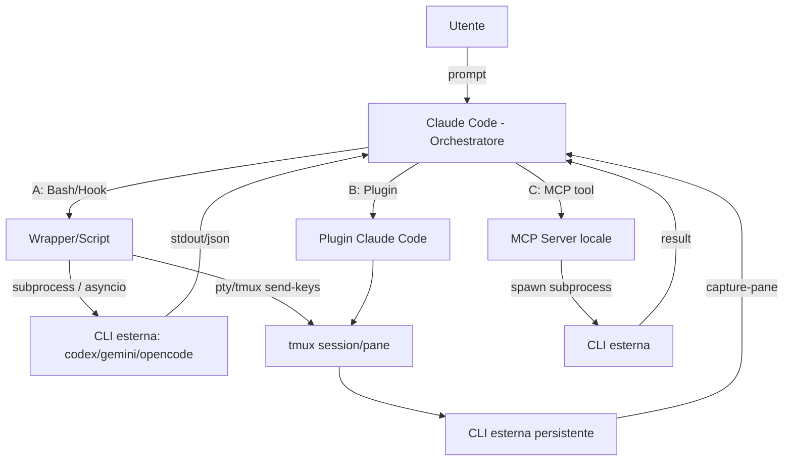
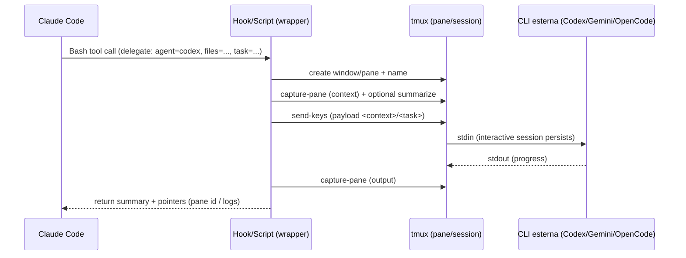

# Orchestrazione deterministica di CLI agent con Claude Code: progetti non‑MCP, wrapper e alternative MCP

## Executive summary

L’orchestrazione “deterministica” di agenti AI in CLI (pattern **processo padre → spawn controllato di subprocessi/TTY/sottosessioni** che eseguono altre CLI) è diventata un sotto‑ecosistema maturo tra fine 2025 e inizio 2026, spinto dall’adozione quotidiana di **Claude Code**, **Codex CLI** e **Gemini CLI** come strumenti operativi (non più “chat”) capaci di leggere/scrivere filesystem ed eseguire comandi. citeturn33view0turn39view0turn37search11

Nel perimetro richiesto (no “swarm” emergenti; sì orchestrazione tipo Unix: **un orchestratore centrale che invoca worker CLI specializzati**), emergono tre famiglie:

- **Non‑MCP, tmux/pty‑based (più “Unix‑native”)**: tmux diventa l’infrastruttura de‑facto per persistenza di sessione e I/O controllabile (send‑keys/capture‑pane), perché mantiene i processi vivi e separa gli stati terminali. Esempi forti: script “thin glue” (Kaushik), primitive tmux‑cli (pchalasani), session manager avanzati (ntm), strumenti TUI con workspaces isolati (Claude Squad). citeturn19view0turn20view0turn42search0turn18view3turn24view2  
- **Wrapper/bridge non‑MCP (subprocess spawning diretto)**: un binario o tool fa da “adapter” tra CLI diverse, normalizzando flag/output e gestendo sessioni/resume. Esempi: **myclaude** (Claude Code come orchestratore + `codeagent-wrapper` come executor multi‑backend), **codex‑orchestrator** (plugin Claude Code → spawn Codex via tmux), **claude_code_bridge** (collaborazione split‑pane e daemon). citeturn44view0turn39view0turn38view3turn26view0  
- **MCP‑based (da segnalare, ma non preferite)**: qui il pattern rimane simile (orchestratore → tool che spawna/coordina), ma con overhead e superficie di attacco tipici di server locali. Lo **stato dell’arte** è **PAL MCP Server** con **tool `clink`**, che implementa un vero **CLI‑to‑CLI bridge**: lancia CLIs esterne come subprocessi (async) in contesti isolati e riporta solo i risultati. Alternative MCP interessanti: CAO (AWS), Roundtable, Owlex, Gemini CLI Orchestrator. citeturn32view3turn7view0turn11view1turn35search5turn28view0turn28view1turn28view2

Risultati pratici (raccomandazione sintetica):

- Se **accetti MCP** e vuoi il massimo “pronto produzione” per **Claude Code → spawn CLI esterne**: **PAL `clink`** è oggi il riferimento per breadth e maturità, con implementazione robusta di subprocess async e registry di client/ruoli. citeturn33view0turn7view0turn11view1  
- Se **non vuoi MCP** e vuoi **tool‑agnostic**: lo script tmux‑subagent di Kaushik è la baseline più semplice e adattabile; per qualcosa di più “prodotto”, **tmux‑cli** (claude-code-tools) ti dà primitive riusabili. citeturn19view0turn20view0turn42search0turn43view0  
- Se vuoi **delegazione Claude→Codex** molto chiara e deterministica senza MCP: **codex‑orchestrator** (plugin Claude Code) formalizza spawn/monitor/send/capture su job Codex in tmux. citeturn39view0turn26view0  
- Se vuoi **multi‑backend con normalizzazione flag/output**: **myclaude** esplicita architettura Orchestrator (Claude Code) ↔ Executor (`codeagent-wrapper`) e dichiara requisiti/flag per backend diversi. citeturn36search0turn44view0  
- Se vuoi **isolation del filesystem per task paralleli** (anche se human‑managed): **Claude Squad** usa tmux + git workspaces isolati (“no conflicts”). citeturn24view2turn34search12

## Ambito e concetti chiave

Questo report filtra esplicitamente:

- **Incluso**: orchestrazione deterministica dove **Claude Code (o un wrapper attivabile da Claude Code)** può invocare altre CLI (Codex, Gemini, OpenCode, ecc.) con meccanismi tecnici verificabili: `subprocess`, `asyncio.create_subprocess_exec`, wrapper CLI, pseudo‑terminal (pty), tmux (send‑keys/capture‑pane), hook/scripting, plugin system. citeturn11view1turn20view0turn42search0turn39view0  
- **Escluso come obiettivo primario**: “swarm” o coordinamento emergente; tuttavia alcuni progetti ibridi (Octopus, CAO, Roundtable) vengono **segnalati** quando forniscono componenti utili (quality gate, API, auto‑discovery), pur non essendo perfettamente allineati alla preferenza “no agenti coordinati”. citeturn40view0turn35search7turn28view0  

Baseline nativa Claude Code (per capire cosa manca e perché nascono questi progetti):

- **Hooks**: Claude Code offre hook su eventi del lifecycle (es. `PreToolUse`, `SubagentStart`, `Stop`, `TeammateIdle`…), e un hook può perfino influenzare decisioni di permesso prima del sistema di permissions. citeturn23view0turn23view1  
- **Agent teams** (sperimentale): split‑pane richiede tmux/iTerm2; niente nested teams; costi token elevati (lineare col numero di teammate; circa **~7x** in plan mode). citeturn14view0turn15view0  

Nota importante sulla “statelessness”: molte analisi storiche assumevano che CLI agent in modalità headless fossero “stateless”. In pratica, **Gemini CLI ha introdotto Session Management** con salvataggio automatico e ripristino, e perfino un comportamento di “auto‑restoration” discusso in issue dedicata: quindi lo stato può esistere e va governato (determinismo vs resume implicito). citeturn37search11turn37search3turn37search16  

## Stato dell’arte: pattern architetturali e gap

### Pattern architetturali comuni

Il panorama attuale converge su quattro pattern ripetuti:

**Pattern tmux‑substrate (persistenza e “stato gratis”)**  
tmux offre le primitive necessarie a simulare un “controllo interattivo” di altri agenti: mantenere processi vivi, inviare input, catturare output, nominare sessioni/pane, attaccare/staccare. È la base sia di soluzioni “thin glue” (tmux‑subagent) sia di prodotti completi (Claude Squad, ntm). citeturn19view0turn20view0turn24view2turn18view3  

**Pattern wrapper/adapters (normalizzazione, output machine‑readable, rate limit)**  
La distanza tra CLI diverse spesso sta nei flag per output JSON/stream e nelle policy di permessi/sandbox. I wrapper cercano di normalizzare (es. “backend requirements” dichiarati in myclaude) e di imporre discipline (timeouts, parsing JSON, concurrency limits). citeturn44view0turn22view0turn11view1  

**Pattern “CLI‑to‑CLI bridge” (subprocess isolati)**  
Qui il focus è evitare contaminazione del contesto: il parent invoca un worker in un nuovo processo e ne riceve solo il risultato. Il caso più completo è `clink` in PAL, che implementa subprocess async con timeout/kill e supporta output file opzionale. citeturn7view0turn11view1turn11view2  

**Pattern quality‑gate / deliberazione** (segnalato, non preferito)  
Alcuni progetti spostano il valore su validazione (consensus, cross‑critique). Octopus ad esempio dichiara ruoli per provider e “75% consensus quality gate”. citeturn40view0turn17search3  

### Gap tecnologici ricorrenti

- **Passaggio di contesto controllato**: catturare “solo ciò che serve” (file rilevanti, porzioni di log, diff) per ridurre costo e rumore. NTM formalizza “Prompt Context Injection” con limiti per file e range di linee; Kaushik introduce soglie e summarization opzionale prima di forcare. citeturn18view3turn20view0turn19view0  
- **Determinismo vs session‑resume implicito**: quando una CLI salva/ripristina sessioni automaticamente (Gemini CLI), l’orchestrazione deterministica deve decidere se riusare o disabilitare l’auto‑restore per evitare “stato fantasma”. citeturn37search11turn37search3  
- **Sicurezza e isolamento “veri”**: molti tool usano scorciatoie tipo bypass approvals o auto‑yes. Claude Code permette defense‑in‑depth con permissions + sandboxing; e gli hook `PreToolUse` possono bloccare comandi distruttivi prima dell’esecuzione. citeturn23view1turn23view0turn15view0  
- **Superficie MCP**: MCP dà potenza ma aumenta “server‑like attack surface”. Ricerca/incidenti riportano rischi concreti di misconfigurazioni MCP con possibili RCE/data leak; questo spiega perché molte alternative non‑MCP scelgono tmux/script. citeturn34search10turn34search7  

## Tabella comparativa dei progetti

Legenda punteggi (1–5): **Int** integrazione con Claude Code; **Iso** robustezza/isolation; **Mat** maturità/adozione; **Flex** supporto multi‑CLI; **Act** manutenzione attiva.

| Progetto (repo) | Categoria | Linguaggio / licenza | Come evoca altre CLI | Supporto esplicito Claude Code / LLM‑CLI | Dipendenze esterne | Sicurezza & isolamento (highlights) | Maturità (stelle/fork/release) | Compatibilità | Punteggi |
|---|---|---|---|---|---|---|---|---|---|
| PAL MCP Server (`https://github.com/BeehiveInnovations/pal-mcp-server`) | MCP + CLI‑to‑CLI bridge | Python / Apache‑2.0 citeturn33view0 | Tool `clink` spawna CLI esterne come subprocess async (`asyncio.create_subprocess_exec`) con timeout/kill; registry client/ruoli citeturn11view1turn7view0turn32view3 | Config snippet per `~/.claude/settings.json`; clink da qualunque CLI (Claude/Codex/…) citeturn32view0turn7view0 | MCP server locale; uvx/venv; CLI target installate citeturn32view0turn7view0 | Isolamento “fresh context”; ma usa flag di bypass approvals per automazione (rischio) citeturn7view0turn7view0 | 11.1k★, 934 fork, 74 release (v9.8.2) citeturn33view0 | Cross‑platform “tipico Python”, ma dipende dalle CLI target | Int 4 · Iso 4 · Mat 5 · Flex 5 · Act 5 |
| tmux‑subagent (gist) (`https://gist.github.com/kaushikgopal/3a67f71052cf10276315162012dcac1c`) | Non‑MCP / tmux thin‑glue | Bash / n.s. | Cattura transcript (`tmux capture-pane`), opzionale summary, crea nuova window e incolla payload `<context>/<task>`; può usare `claude -p` o `gemini -p` per summarization citeturn20view0turn19view0 | Tool‑agnostic: pensato per partire in codex e forcare in claude/gemini (interattivo) citeturn19view0turn20view0 | tmux + CLI nel PATH citeturn19view0turn20view0 | Evita “context bloat” con soglie; attenzione a modalità pericolose (es. `claude --dangerously-skip-permissions` nel bootstrap) citeturn20view0turn23view1 | Gist (adozione limitata; 0★ al crawl) citeturn20view0 | Dipende da tmux (macOS/Linux; su Windows via WSL) | Int 3 · Iso 3 · Mat 2 · Flex 5 · Act 2 |
| claude‑code‑tools (`https://github.com/pchalasani/claude-code-tools`) | Non‑MCP / toolkit + tmux‑cli | Python+Rust / MIT citeturn43view0 | `tmux-cli` dà primitive: launch/send/capture/kill programmi in pane tmux (anche fuori tmux creando session dedicata) citeturn42search0turn43view0 | Nativo per Claude Code (plugin marketplace + docs); utile anche per altri agenti CLI citeturn42search0turn43view0 | tmux; (alcune feature richiedono binario Rust `aichat-search`) citeturn43view0 | Security dipende da policy utente; vantaggio: controlli granulari e ispezionabilità; niente MCP obbligatorio citeturn42search0turn23view0 | 1.5k★, 91 fork, 93 release (v1.10.6, 16 Feb 2026) citeturn43view0 | Cross‑platform con tmux (Windows: WSL) | Int 4 · Iso 4 · Mat 4 · Flex 5 · Act 5 |
| ntm (`https://github.com/Dicklesworthstone/ntm`) | Non‑MCP / tmux manager | Go / MIT citeturn18view0 | `ntm spawn <session> --cc=N --cod=N --gmi=N`; invio selettivo `ntm send ... --files file:range`; supporto “robot mode” JSON stdout citeturn18view3turn34search2 | Esplicito per Claude/Codex/Gemini; tipizzazione agent‑type per broadcast citeturn18view3turn34search2 | tmux; (repo include Dockerfile) citeturn18view2turn18view3 | “Design principles” anti‑data‑loss; blocco azioni distruttive di default; injection limit (1MB/file, 10MB totale) citeturn18view3turn18view2 | 147★, 22 fork, 2,237 commit citeturn18view0turn18view3 | Cross‑platform Go + tmux (Windows tipicamente via WSL) | Int 4 · Iso 4 · Mat 3 · Flex 4 · Act 4 |
| Claude Squad (`https://github.com/smtg-ai/claude-squad`) | Non‑MCP / TUI session manager | Go / AGPL‑3.0 citeturn24view2 | Gestisce agent in session tmux; ogni task in “isolated git workspace”; autoyes per alcune CLI citeturn24view2turn25view0 | Supporta Claude Code, Codex, Gemini, Aider (configurabile con `-p`) citeturn24view2 | tmux + gh; install brew/script citeturn24view2 | Forte isolation via git workspace separati (“no conflicts”), review diff prima di applicare citeturn24view2turn34search12 | 6k★, 407 fork, 15 release (v1.0.14) citeturn24view2 | tmux richiesto (Windows: WSL) | Int 3 · Iso 5 · Mat 5 · Flex 4 · Act 4 |
| Claude Code Bridge / ccb (`https://github.com/bfly123/claude_code_bridge`) | Non‑MCP core (con opzione MCP) / split‑pane | Python / MIT citeturn38view2turn38view3 | Split‑pane (WezTerm raccomandato o tmux); set di “skills”/daemon per inviare richieste e leggere risposte tra CLI citeturn38view3turn12view0 | Esplicito: Claude+Codex+Gemini+OpenCode; “ultra‑low token” come design goal citeturn38view2turn12view0 | Python 3.10+; WezTerm o tmux citeturn38view3 | Ottimizzazioni token dichiarate (~60–65% su alcuni file skill); cleanup zombie session citeturn38view3 | 1.2k★, 113 fork, 386 commit; 1 release (video.mp4) citeturn38view0turn38view3 | Windows support (WSL + nativo via WezTerm) citeturn38view3 | Int 3 · Iso 3 · Mat 4 · Flex 5 · Act 4 |
| codex‑orchestrator (`https://github.com/kingbootoshi/codex-orchestrator`) | Non‑MCP / Claude plugin → Codex worker | JS/Bun tooling + tmux / MIT citeturn39view0turn26view0 | `codex-agent start/jobs/capture/send/...` gestisce job Codex in tmux; monitor JSON; redirect mid‑task citeturn39view0turn26view0 | “Designed for Claude Code orchestration”; install via `/plugin marketplace add` citeturn39view0turn26view0 | tmux + Bun + Codex CLI citeturn26view0turn39view0 | Separation of concerns: Claude strategia/sintesi, Codex esecuzione; suggerisce sandbox read‑only/workspace‑write a livello job citeturn26view0turn39view0 | 200★, 31 fork, 13 commit citeturn39view0 | macOS/Linux; Windows via WSL citeturn39view0 | Int 4 · Iso 4 · Mat 3 · Flex 2 · Act 3 |
| myclaude (`https://github.com/cexll/myclaude`) | Non‑MCP / orchestrator‑executor | Go+altro / AGPL‑3.0 citeturn36search0turn44view0 | Claude Code (orchestratore) instrada a `codeagent-wrapper` (executor multi‑backend); dichiara requisiti flag per backend (json/stream/resume) citeturn44view0turn36search1 | Esplicito: Codex/Claude/Gemini/OpenCode; install con `npx github:cexll/myclaude` citeturn44view0turn36search0 | Richiede CLI backend installate; install in `~/.claude/` citeturn44view0turn36search0 | Approccio adapter; include skill install e moduli; (molte feature oltre lo scope “no multiagent”) citeturn44view0turn36search3 | 2.3k★, 262 fork, 65 release (v6.7.1 ~3 giorni) citeturn36search0 | Go cross‑platform; dipende dalle CLI target | Int 3 · Iso 4 · Mat 4 · Flex 5 · Act 5 |
| CAO (`https://github.com/awslabs/cli-agent-orchestrator`) | MCP + tmux + HTTP API | Python / Apache‑2.0 citeturn35search9turn35search0 | Hierarchy supervisor/worker; 3 primitive: handoff/assign/send_message; API FastAPI (porta 9889) citeturn35search7turn35search5 | Supporta CLI agent in tmux; AWS blog lo posiziona per CLI tipo Amazon Q e Claude Code citeturn35search4turn35search0 | tmux + MCP server + servizi di background (flows/cleanup/inbox) citeturn35search5turn35search7 | Struttura e API migliorano auditabilità; resta MCP‑based (overhead/surface) citeturn35search5turn34search10 | 229★, 51 fork citeturn35search9 | tmux best su macOS/Linux; Windows tipicamente WSL | Int 2 · Iso 4 · Mat 3 · Flex 3 · Act 4 |
| Owlex (`https://github.com/agentic-mcp-tools/owlex`) | MCP / “council” deliberativo | Python / MIT citeturn28view1 | Tool `council_ask`: Round1 risposte indipendenti, Round2 revisione/critique, poi sintesi Claude citeturn28view1 | Esplicito: “second opinion” da Claude Code verso Codex/Gemini/OpenCode citeturn28view1 | MCP server locale (install `uv tool install ...`) citeturn28view1 | Valore su validazione/consenso (non su spawn worker interattivi persistenti) citeturn28view1 | 48★, 3 fork citeturn28view1 | Cross‑platform Python | Int 4 · Iso 3 · Mat 2 · Flex 3 · Act 3 |
| Roundtable (`https://github.com/askbudi/roundtable`) | MCP / auto‑discovery | Python / MIT citeturn29view0turn29view3 | `roundtable-ai --check`, dispatch parallelo a agent selezionati; one‑liner `claude mcp add ...` citeturn28view0turn29view1 | Dice “Works with Claude Code…”, delega a Gemini/Claude/Codex/Cursor citeturn28view0 | MCP server locale; usa CLI esistenti e subscription “zero markup” citeturn28view0 | Forza su semplicità; meno controllo fine su isolation FS citeturn28view0turn34search10 | 66★, 11 fork, 30 commit, no release citeturn29view0turn29view2 | Cross‑platform Python | Int 4 · Iso 3 · Mat 2 · Flex 4 · Act 3 |
| gemini‑cli‑orchestrator (`https://github.com/dnnyngyen/gemini-cli-orchestrator`) | MCP / specializzato Gemini | JS / MIT citeturn30view0turn30view2 | Tool guidati (`gemini_plan_analysis`, `gemini_craft_prompt`, …) per workflow analisi “sequenziale” citeturn28view2 | Include “Try your first analysis (using Claude Code CLI)” citeturn28view2 | Node + Gemini CLI login citeturn28view2 | Riduce errori di analisi con metaprompting; non è un general dispatcher multi‑CLI citeturn28view2 | 24★, 5 fork, no release citeturn30view0turn30view3 | Cross‑platform Node | Int 3 · Iso 3 · Mat 2 · Flex 2 · Act 3 |
| AI‑Agents‑Orchestrator (`https://github.com/hoangsonww/AI-Agents-Orchestrator`) | Framework / pipeline multi‑CLI | Python (+ UI Vue) / MIT citeturn41view0turn27view0 | Adapter layer per CLI eterogenee; workflow definiti (sequenziale/parallelo/iterativo) citeturn27view0turn41view0 | Esplicito: Claude/Codex/Gemini/Copilot; mostra pipeline Codex→Gemini→Claude citeturn41view0turn27view0 | Dipendenze “enterprise-grade” (UI, Docker, osservabilità) citeturn27view0turn41view0 | Ambizioso (security layer, rate limiting, audit logging dichiarati), ma early citeturn27view0 | 13★, 9 fork, 36 commit citeturn41view0 | Cross‑platform ma complesso | Int 2 · Iso 3 · Mat 2 · Flex 4 · Act 2 |
| Claude Octopus (`https://github.com/nyldn/claude-octopus`) | Plugin Claude Code / multi‑provider gates | (repo multi‑file) / MIT citeturn40view0turn17search7 | Coordina provider (Codex/Gemini/Claude); comandi `/octo:*`; scheduling e gate; consenso 75% citeturn40view0turn17search3 | Richiede Claude Code v2.1.34+; setup guidato `/octo:setup` citeturn40view0turn17search7 | Plugin system Claude Code + provider esterni opzionali citeturn40view0 | Forte su quality gates/consensus; meno “Unix‑simple”; oltre lo scope “no coordinati” citeturn40view0turn17search3 | 681★, 59 fork, 432 commit; versione 8.15.1 citeturn40view0 | Dipende da provider installabili; OS come Claude Code | Int 3 · Iso 3 · Mat 3 · Flex 4 · Act 4 |
| using‑claude‑code‑cli skill (`https://github.com/SpillwaveSolutions/using-claude-code-cli-agent-skill`) | Skill/patterns di automazione | Python / MIT citeturn21view0 | Pattern subprocess sync/async (no shell), parallel con semaphore, sandbox via stdin citeturn22view0turn21view0 | Utile per far diventare Claude Code una “CLI invocabile” dentro wrapper/orchestratori citeturn21view0turn16search10 | Richiede Claude Code CLI | Best practice anti shell‑injection; timeouts obbligatori; suggerisce sandbox mode citeturn22view0turn23view1 | 1★, issues attive (9) citeturn21view0 | Cross‑platform Python | Int 3 · Iso 4 · Mat 1 · Flex 2 · Act 3 |

## Analisi dei casi più rilevanti

Di seguito un’analisi più profonda (tecnica, pro/contro) dei casi che meglio mappano il requisito “Claude Code → spawn CLI esterne” senza introdurre swarm non deterministici.

**PAL MCP Server: `clink` come vero “CLI‑to‑CLI bridge” (ma MCP)**  
`clink` è il caso più vicino al requisito “subprocess isolato, risultato pulito”: la documentazione lo descrive come bridge CLI‑to‑CLI capace di lanciare istanze isolate di CLI esterne “senza lasciare la sessione”, mantenendo il contesto principale non inquinato. citeturn32view3turn7view0  
Dal punto di vista implementativo, la parte più “load‑bearing” è l’esecuzione asincrona di processi con `asyncio.create_subprocess_exec`, gestione di timeout e kill del processo in caso di sforamento; opzionalmente può scrivere l’output su file. citeturn11view1turn11view2  
Il limite principale (da trattare con rigore) è la necessità pratica di **automation flags**: la doc nota esplicitamente che Gemini può richiedere `--yolo` per permettere `run_shell_command`, e per Codex cita `--dangerously-bypass-approvals-and-sandbox`; ciò abilita automazione, ma aumenta il rischio e va confinato a sandbox/worktree/container. citeturn7view0turn23view1turn37search2  
Discussione pubblica utile: thread HN su PAL/CLINK. `https://news.ycombinator.com/item?id=46401536` citeturn34search1  

**tmux‑subagent (Kaushik): la baseline non‑MCP più “pura”**  
Il valore è nella filosofia dichiarata: “super thin glue layer” + tmux, perché i wrapper spessi tendono a inseguire strumenti che cambiano rapidamente. citeturn19view0  
Tecnicamente lo script: cattura un numero configurabile di linee del pane master, opzionalmente le riassume (con Claude o Gemini headless), crea una nuova window tmux e inietta un payload standardizzato `<context>…</context><task>…</task>` usando tmux buffers/paste. citeturn20view0turn19view0  
Punti di forza: tool‑agnostic, persistenza sessione, overhead minimo, e soprattutto determinismo operativo (sei tu/Claude a decidere quando forcare, cosa passare e quando reintegrare). Limiti: niente isolamento filesystem nativo (a meno di abbinarlo a worktree), e serve disciplina sulla sicurezza (lo script propone anche modalità “dangerous skip permissions” per Claude). citeturn20view0turn23view1  

**`tmux-cli` (claude-code-tools): primitive riusabili per costruire orchestrazioni controllate**  
Questo progetto è interessante perché “industrializza” il pattern tmux senza imporre un framework rigido: `tmux-cli` espone capacità di lanciare programmi in pane, inviare input, catturare output e killare processi; supporta sia gestione “local mode” (dentro tmux) sia “remote mode” (fuori tmux creando una session dedicata). citeturn42search0turn43view0  
In ottica Claude Code, è un “set di syscall di orchestrazione” più che un orchestratore completo: eccellente per costruire flussi deterministici del tipo “Claude manda prompt a Codex in pane X, poi legge output e sintetizza”. Inoltre mostra segnali forti di maturità: molte release e commit recentissimi. citeturn43view0  

**codex‑orchestrator: delega deterministica Claude→Codex con job control**  
È la proposta più pulita quando l’obiettivo è specifico: fare di **Claude Code il “general”** e di **Codex il “worker”**. Il repository descrive esplicitamente spawn di agenti, monitoraggio, redirect mid‑task e capture risultati “all from Claude Code or the command line”. citeturn39view0turn26view0  
L’API di lavoro è centrata su un CLI (`codex-agent`) con comandi `start/jobs/capture/send/kill` e output JSON per stato e metriche. Questo è molto coerente con un workflow deterministico e debuggabile. citeturn39view0turn26view0  
Limiti: è focalizzato su Codex; l’estensione ad altri worker CLI richiede duplicare l’approccio (o adottare wrapper multi‑backend come myclaude).

**myclaude: architettura Orchestrator‑Executor multi‑backend (non MCP)**  
myclaude descrive chiaramente il “dual role”: **Claude Code = orchestrator (planning, context, verification)** mentre **`codeagent-wrapper` = executor** che esegue editing e test usando backend diversi (Codex/Claude/Gemini/OpenCode). citeturn44view0turn36search0turn36search1  
La cosa più pratica per orchestrazione CLI‑eterogenea è la sezione “Backend CLI Requirements”, dove vengono elencate feature/flag attese per ogni CLI (es. JSON/stream/resume). Questo rende esplicito il contratto e riduce fragilità da “flag drift”. citeturn44view0  
Limite rispetto al requisito originale: include componenti multi‑agent e routing “intelligente” (`/omo`) che possono sconfinare verso coordinamento più complesso (pur restando strutturato). citeturn36search3turn44view0  

**Claude Squad: massima isolation del filesystem, ma orchestrazione “human‑managed”**  
È un terminal app che gestisce più agenti in workspaces separati, con highlight su “ogni task ha un git workspace isolato, quindi niente conflitti”; usa tmux e git workspaces come fondamenta e permette review/checkout prima di push/apply. citeturn24view2turn34search12  
Il limite, nel tuo perimetro, è che non è principalmente “Claude spawna altri CLI”, ma “l’umano gestisce più sessioni” (utile però come substrate di isolamento).

**ntm: tmux manager con injection controllata e principi di sicurezza espliciti**  
NTM rende formalizzabile ciò che spesso è “artigianale”: spawn tipizzato di popolazioni di agenti (`--cc/--cod/--gmi`), invio mirato con injection di file e range di linee, e limiti di dimensione per evitare incidenti di contesto (1MB/file, 10MB totali). citeturn18view3turn34search2  
In più dichiara invarianti di design come “No Silent Data Loss” e blocco di comandi distruttivi di default (approccio “guardrails-first”). citeturn18view3turn18view2  
Limite: adozione più piccola e governance “maintainer‑centric” (nel README dichiara di non accettare contributi esterni). citeturn18view2  

## Raccomandazioni pratiche per implementare Claude Code → spawn CLI esterne

Questa sezione traduce lo “stato dell’arte” in un blueprint deterministico, non‑swarm, che puoi applicare subito. Le raccomandazioni sono ordinate per “minimo lock‑in” e “massimo controllo”.

### Scelta del meccanismo: subprocess vs tmux

Se vuoi **determinismo + debuggabilità + persistenza**, tmux è spesso la scelta migliore (lavori con sessioni reali, attaccabili). È la stessa direzione del supporto split‑pane negli agent teams (anche se lì sono solo istanze Claude). citeturn14view0turn23view0  

Se vuoi **isolamento forte del contesto** e un ritorno “pulito” (solo output), preferisci subprocess headless con output JSON/stream (o wrapper che lo gestisce), come fa `clink` o come suggeriscono i pattern di orchestrazione in `using-claude-code-cli`. citeturn11view1turn22view0turn16search10  

### Blueprint non‑MCP: tmux + wrapper sottile + policy di sicurezza Claude Code

Implementazione pratica con componenti già pronti:

- **Fork tool‑agnostic**: adotta/estendi tmux‑subagent di Kaushik (cattura transcript, summarization opzionale, spawn nuova window e injection). citeturn20view0turn19view0  
- **Primitive riusabili**: usa `tmux-cli` di claude-code-tools per evitare di reinventare send/capture/kill con quoting fragile. citeturn42search0turn43view0  
- **Isolamento filesystem**: se il worker deve modificare file, abbina **git workspace isolato** (stile Claude Squad) o imponi policy read‑only per i worker e fai applicare le patch solo al parent. citeturn24view2turn23view1  

### Blueprint non‑MCP: subprocess headless “safe-by-default” (quando non serve persistenza)

Quando vuoi invocazioni “one‑shot” deterministiche (es. un audit, una review, un riassunto), implementa un wrapper che:

- costruisce un “context pack” (file selezionati + snippet),
- invoca la CLI target in modalità headless,
- parse output JSON/stream,
- ritorna a Claude solo il risultato e (opzionale) un log file.

Punti chiave di sicurezza (da adottare sempre):

- **mai** `shell=True`; usa liste di argomenti (pattern raccomandato nei subprocess patterns). citeturn22view0  
- timeouts obbligatori, e kill del processo in caso di sforamento (pattern usato anche da clink subprocess agent). citeturn11view1turn11view2  
- rate limiting: semaphore/concurrency cap, come mostrato nei pattern paralleli. citeturn22view0  

### Usare Hooks e Permissions di Claude Code come “controllo deterministico”

Per evitare che Claude (o un worker) esegua comandi rischiosi, sfrutta defense‑in‑depth:

- **PreToolUse hooks**: possono bloccare comandi distruttivi e decidere `permissionDecision` prima dell’exec (esempio ufficiale “block rm -rf”). citeturn23view0  
- **Permissions + sandboxing**: Claude Code separa regole di permesso (tool/file/domain) e sandbox OS‑level per Bash; usarle insieme è raccomandato “defense‑in‑depth”. citeturn23view1turn15view0  

### Quando serve MCP (e come ridurre rischi)

Se adotti MCP (PAL/CAO/Roundtable/Owlex), tratta il server locale come un componente “sensibile”:

- minimizza tool abilitati e superficie; Claude Code nota che tool MCP aggiungono definizioni in contesto (overhead) e suggerisce disabling/threshold e preferenza per CLI dirette quando possibile. citeturn15view0  
- considera la letteratura di rischio su misconfigurazioni MCP con potenziali impatti severi (RCE/data leak) come motivazione per hardening (firewall locale, least privilege, audit). citeturn34search10turn34search7  

## Progetti da monitorare e criteri di scelta

### Progetti da monitorare

- **claude-code-tools / tmux-cli**: ritmo di release molto alto e obiettivo “toolbox”, ideale come base stabile mentre le CLI cambiano rapidamente. citeturn43view0turn42search0  
- **myclaude**: wrapper multi‑backend con release frequenti; interessante se vuoi standardizzare contratti di output/flag tra CLI eterogenee. citeturn36search0turn44view0  
- **codex‑orchestrator**: se il tuo pattern dominante è Claude→Codex con job control, è già sorprendentemente completo e con adozione in crescita (200★). citeturn39view0turn26view0  
- **ntm**: innovativo su injection controllata e guardrail; vale monitorarlo se vuoi portare ordine e auditabilità nel mondo tmux. citeturn18view3turn34search8  
- **PAL/clink** (se MCP è accettabile): rimane il più “broad” e discusso pubblicamente (HN) per CLI‑to‑CLI. citeturn33view0turn34search1turn11view1  

### Criteri pratici per scegliere

Scegli in base a questi criteri (in ordine di impatto):

- **Quanto deve essere deterministico il flusso?** Se vuoi step riproducibili e debuggabili: job control (codex‑orchestrator) o wrapper headless con JSON. citeturn39view0turn16search10  
- **Serve persistenza di sessione?** Se sì: tmux substrate (tmux‑cli / ntm / Claude Squad). citeturn42search0turn18view3turn24view2  
- **Serve isolamento filesystem serio?** Se sì: workspaces separati (Claude Squad) o policy read‑only per worker + apply dal parent (permissions). citeturn24view2turn23view1  
- **Quanto tolleri MCP?** Se MCP è off‑limits: evita PAL/CAO/Roundtable/Owlex e punta su tmux/subprocess wrappers; se MCP è ok, PAL è la scelta con più adozione. citeturn33view0turn34search10  
- **Cross‑platform reale**: se devi includere Windows, privilegia tool che dichiarano supporto WSL o nativo via WezTerm (ccb) e ricorda che Codex CLI dichiara Windows “experimental” e raccomanda WSL. citeturn38view3turn37search14  

### Link a discussioni e demo (selezione)

- PAL / CLINK su Hacker News: `https://news.ycombinator.com/item?id=46401536` citeturn34search1  
- Show HN su Mysti (utile come riferimento “debate mode” multi‑provider, anche se non è CLI‑first): `https://news.ycombinator.com/item?id=46365105` citeturn36search9  
- Claude Squad include demo (`demo.mp4`) nel README (indicatore utile di workflow e UI). citeturn24view2  
- Claude Code Bridge dichiara “Demo animations” e rilascia un asset video come release. citeturn38view2turn38view3