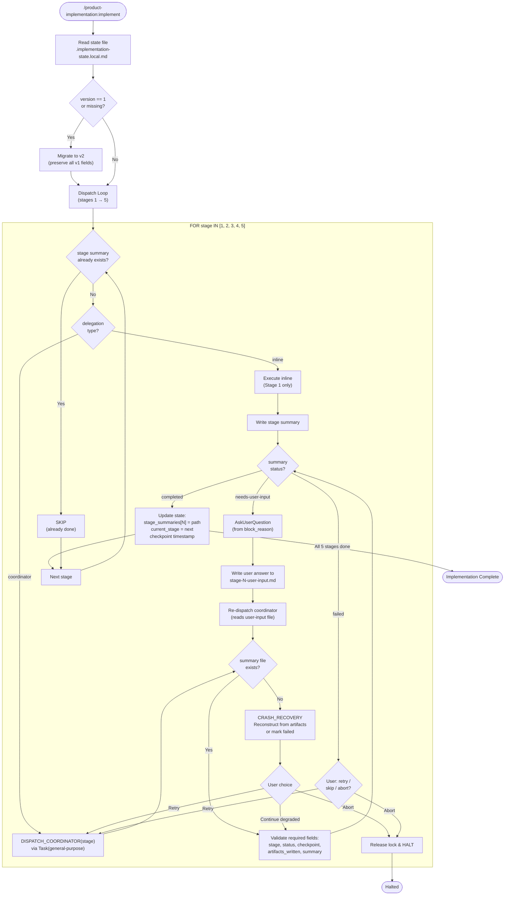
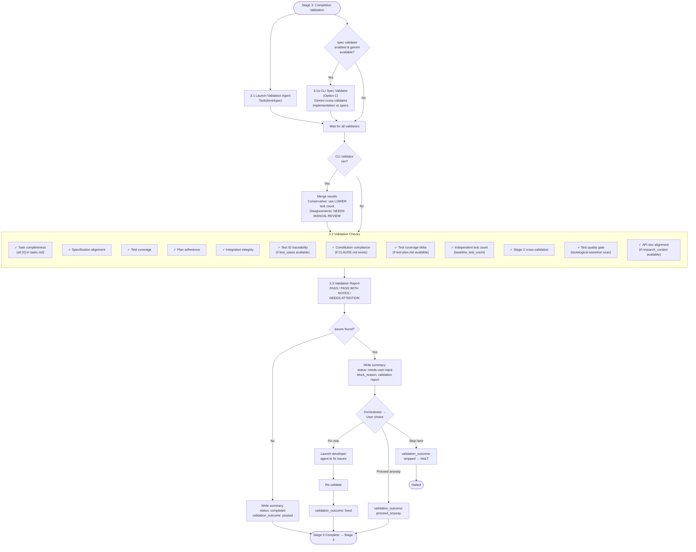
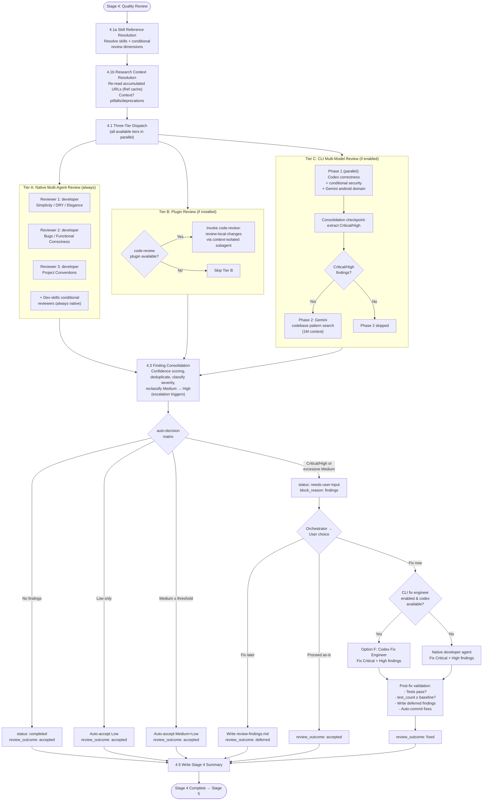
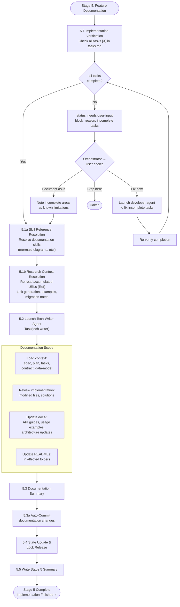
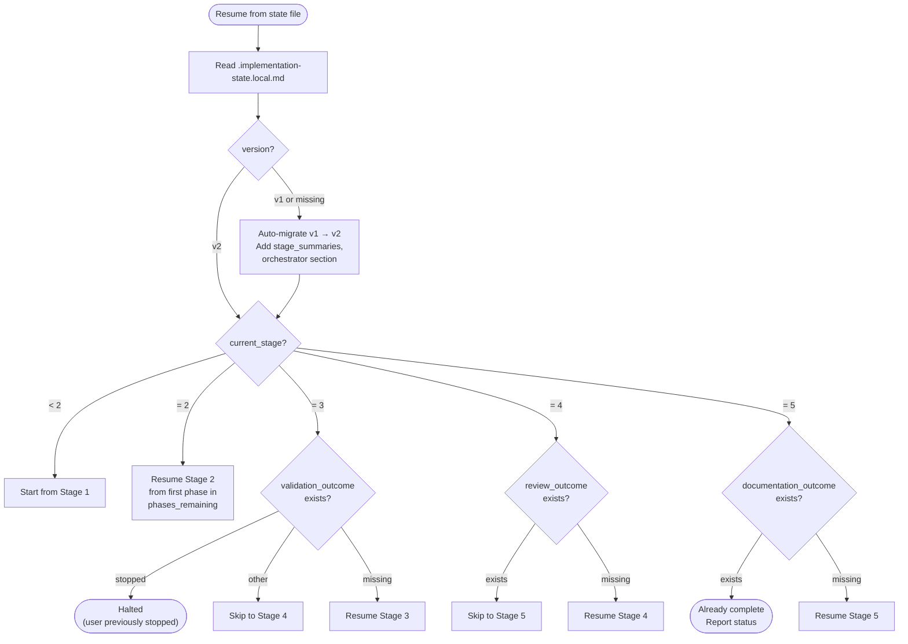

# Feature Implementation Workflow Diagram

> Auto-generated from `skills/implement/` reference files. Keep in sync with SKILL.md v3.0.0.

## High-Level Orchestrator Flow

## Stage 1: Setup & Context Loading (Inline)

```mermaid
flowchart TD
    S1_START(["Stage 1: Setup & Context Loading"]) --> BRANCH["1.1 Branch Parsing\ngit branch --show-current"]
    BRANCH --> DERIVE["Derive: PROJECT_ROOT,\nFEATURE_NAME, FEATURE_DIR,\nTASKS_FILE"]
    DERIVE --> BRANCH_OK{branch format\nmatches?}
    BRANCH_OK -- No --> ASK_USER["AskUserQuestion:\nprovide FEATURE_NAME"]
    BRANCH_OK -- Yes --> REQ_FILES
    ASK_USER --> REQ_FILES

    REQ_FILES["1.2 Required Files Check"]
    REQ_FILES --> HAS_TASKS{tasks.md\nexists?}
    HAS_TASKS -- No --> HALT_TASKS(["HALT: Run\n/product-planning:tasks"])
    HAS_TASKS -- Yes --> HAS_PLAN{plan.md\nexists?}
    HAS_PLAN -- No --> HALT_PLAN(["HALT: Run\n/product-planning:plan"])
    HAS_PLAN -- Yes --> OPT_FILES

    OPT_FILES["1.3 Optional Files\nRead: spec, design, contract,\ndata-model, research, test-plan"]
    OPT_FILES --> EXPECTED["1.3a Expected Files Check\nWarn if missing:\ndesign.md, test-plan.md"]
    EXPECTED --> TEST_DISC["1.3b Test Cases Discovery\nScan test-cases/ directory"]
    TEST_DISC --> CONTEXT_LOAD["1.4 Context Loading\nRead tasks.md, plan.md,\noptional files, CLAUDE.md"]
    CONTEXT_LOAD --> VALIDATE_TASKS["1.5 Tasks.md Validation\nParse phases, tasks, [P] markers\nValidate structure"]

    VALIDATE_TASKS --> EMPTY_CHECK{zero phases?}
    EMPTY_CHECK -- Yes --> HALT_EMPTY(["HALT: tasks.md\nhas no parseable phases"])
    EMPTY_CHECK -- No --> DOMAIN_DET

    DOMAIN_DET["1.6 Domain Detection\nScan task paths + plan.md\nvs config domain_mapping"]
    DOMAIN_DET --> MCP_CHECK["1.6a MCP Availability Check\nProbe: Ref, Context7, Tavily"]
    MCP_CHECK --> URL_EXTRACT["1.6b URL Extraction\nfrom planning artifacts"]
    URL_EXTRACT --> LIB_RESOLVE["1.6c Library ID Pre-Resolution\nvia Context7"]
    LIB_RESOLVE --> PRIV_DOCS["1.6d Private Doc Discovery\nvia Ref"]
    PRIV_DOCS --> CLI_CHECK["1.7a CLI Availability Detection\nHealthcheck: codex, gemini"]
    CLI_CHECK --> LOCK["1.7 Lock Acquisition"]

    LOCK --> LOCK_CHECK{state file\nexists?}
    LOCK_CHECK -- No --> INIT_STATE["1.8 State Init (new)"]
    LOCK_CHECK -- Yes --> LOCK_STATUS{lock\nstatus?}
    LOCK_STATUS -- "not acquired" --> ACQUIRE_LOCK["Acquire lock"]
    LOCK_STATUS -- "stale (>60min)" --> OVERRIDE_LOCK["Override stale lock"]
    LOCK_STATUS -- "active" --> HALT_LOCK(["HALT: Another session\nis active"])
    ACQUIRE_LOCK --> RESUME["1.8 Resume: Read state,\nmigrate v1→v2 if needed,\nreconcile with tasks.md"]
    OVERRIDE_LOCK --> RESUME
    INIT_STATE --> USER_INPUT

    RESUME --> USER_INPUT["1.9 User Input Handling\nParse arguments/preferences"]
    USER_INPUT --> WRITE_S1["1.10 Write Stage 1 Summary\ndetected_domains, mcp_availability,\ncli_availability, extracted_urls,\nresolved_libraries, artifacts table"]
    WRITE_S1 --> S1_DONE(["Stage 1 Complete → Stage 2"])
```

## Stage 2: Phase-by-Phase Execution (Coordinator)

```mermaid
flowchart TD
    S2_START(["Stage 2: Phase-by-Phase Execution"]) --> SKILL_RES["2.0 Skill Reference Resolution\nResolve dev-skills for developer\nagent prompts (once)"]
    SKILL_RES --> RESEARCH_RES["2.0a Research Context Resolution\nPre-read URLs via Ref,\nquery Context7 libraries (once)"]
    RESEARCH_RES --> PHASE_LOOP

    subgraph PHASE_LOOP["2.1 Phase Loop (for each phase in tasks.md)"]
        direction TB
        PARSE["Step 1: Parse Phase Tasks\nExtract [P] parallel, sequential,\nfile targets, dependencies"]
        PARSE --> CLI_TEST{CLI test author\nenabled & codex\navailable?}
        CLI_TEST -- Yes --> TEST_AUTHOR["Step 1.8: CLI Test Author\n(Option H)\nCodex generates TDD tests\nfrom test-case specs"]
        CLI_TEST -- No --> DEV_AGENT
        TEST_AUTHOR --> VERIFY_RED["Verify tests FAIL\n(Red phase)"]
        VERIFY_RED --> DEV_AGENT

        DEV_AGENT["Step 2: Launch Developer Agent\nTask(developer)\nTDD: test → implement → verify\nper task in phase"]

        DEV_AGENT --> VERIFY_PHASE["Step 3: Verify Phase\nAll tasks [X]?\nTests passing?\nNo compile errors?"]
        VERIFY_PHASE --> PHASE_OK{verification\npassed?}

        PHASE_OK -- "Sequential fail" --> HALT_SEQ(["HALT: Report\nfailed task"])
        PHASE_OK -- "Parallel [P] fail" --> COLLECT_FAIL["Collect failures,\ncontinue others"]
        PHASE_OK -- Yes --> UPDATE_PROG["Step 4: Update Progress\nMark [X] in tasks.md\nUpdate state file"]

        COLLECT_FAIL --> UPDATE_PROG

        UPDATE_PROG --> AUTO_COMMIT{auto_commit\nstrategy?}
        AUTO_COMMIT -- per_phase --> COMMIT_PHASE["Step 4.5: Auto-Commit\nphase changes"]
        AUTO_COMMIT -- batch --> NEXT_PHASE
        COMMIT_PHASE --> NEXT_PHASE

        NEXT_PHASE{more phases?}
        NEXT_PHASE -- Yes --> PARSE
    end

    NEXT_PHASE -- No --> CLI_AUG{test augmenter\nenabled & gemini\navailable?}
    CLI_AUG -- Yes --> TEST_AUG["2.1a CLI Test Augmenter\n(Option I)\nGemini discovers edge cases\nConfirm bug discoveries"]
    CLI_AUG -- No --> BATCH_CHECK
    TEST_AUG --> BATCH_CHECK

    BATCH_CHECK{batch commit\nneeded?}
    BATCH_CHECK -- Yes --> BATCH_COMMIT["Batch auto-commit\nall phases"]
    BATCH_CHECK -- No --> WRITE_S2
    BATCH_COMMIT --> WRITE_S2

    WRITE_S2["2.3 Write Stage 2 Summary\ntest_count_verified,\ncommits_made,\nresearch_urls_discovered"]
    WRITE_S2 --> S2_DONE(["Stage 2 Complete → Stage 3"])
```

## Stage 3: Completion Validation (Coordinator)

## Stage 4: Quality Review (Coordinator)

## Stage 5: Feature Documentation (Coordinator)

## Inter-Stage Data Flow

```mermaid
flowchart LR
    subgraph S1["Stage 1 Summary (Context Bus)"]
        S1A["detected_domains"]
        S1B["mcp_availability"]
        S1C["cli_availability"]
        S1D["extracted_urls"]
        S1E["resolved_libraries"]
        S1F["private_doc_urls"]
        S1G["test_cases_available"]
        S1H["Planning Artifacts Table"]
    end

    subgraph S2["Stage 2 Summary"]
        S2A["test_count_verified"]
        S2B["commits_made"]
        S2C["research_urls_discovered"]
        S2D["augmentation_bugs_found"]
    end

    subgraph S3["Stage 3 Summary"]
        S3A["baseline_test_count"]
        S3B["validation_outcome"]
        S3C["test_coverage_delta"]
    end

    subgraph S4["Stage 4 Summary"]
        S4A["review_outcome"]
        S4B["test_count_post_fix"]
        S4C["commit_sha"]
    end

    subgraph S5["Stage 5 Summary"]
        S5A["documentation_outcome"]
        S5B["commit_sha"]
    end

    S1 -->|"domains, MCP,\nCLI, URLs,\nlibraries"| S2
    S1 -->|"domains,\ntest_cases"| S3
    S1 -->|"domains,\ncli_availability"| S4
    S1 -->|"detected_domains"| S5

    S2 -->|"test_count,\nresearch_urls"| S3
    S2 -->|"research_urls"| S4
    S2 -->|"research_urls"| S5

    S3 -->|"baseline_test_count,\nvalidation_outcome"| S4
    S3 -->|"validation result"| S5
    S4 -->|"review_outcome"| S5
```

## Resume & Recovery Logic

