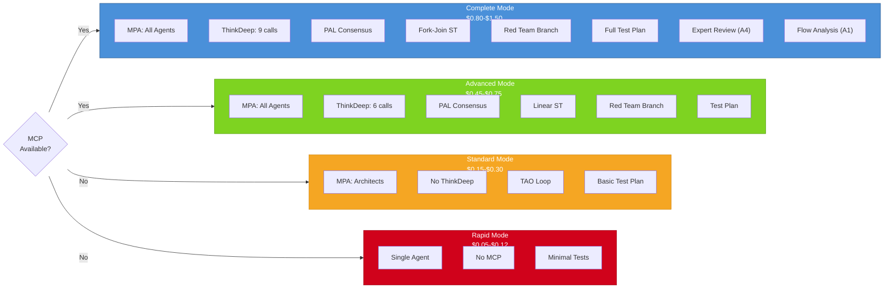
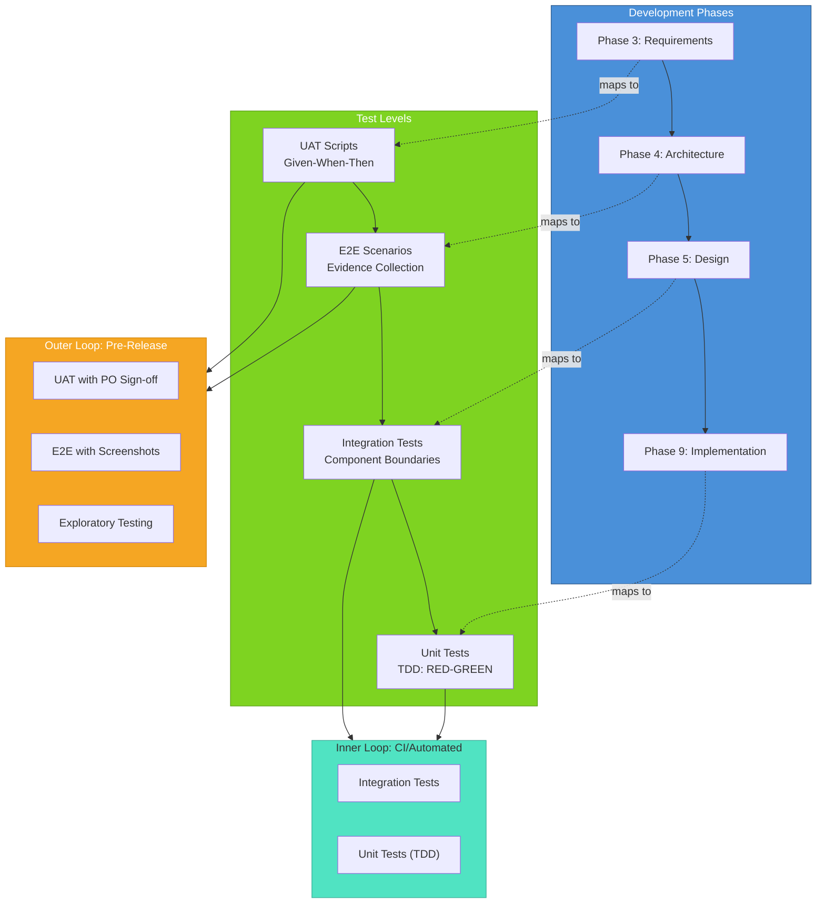
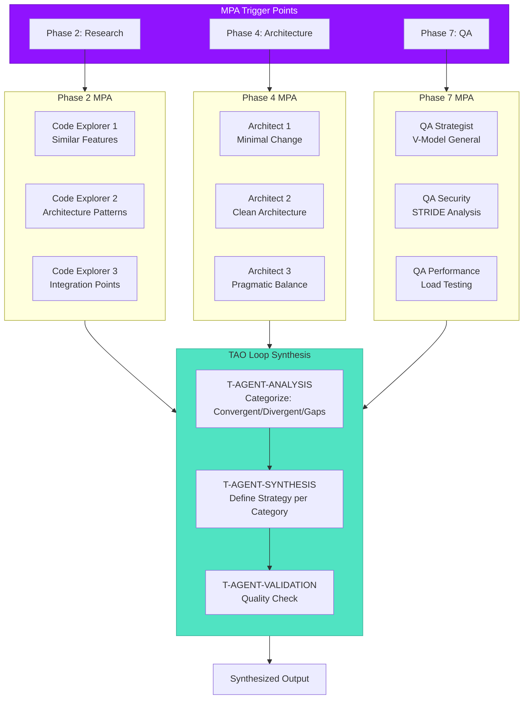
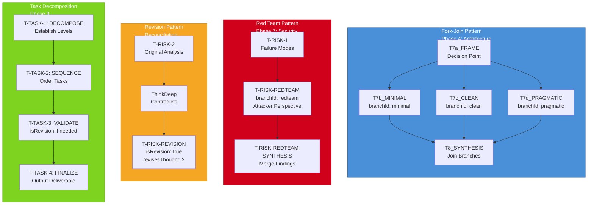

# Product Planning Workflow Diagram

## Main 9-Phase Workflow (V-Model)

```mermaid
flowchart TB
    %% Styling
    classDef phase fill:#4A90D9,stroke:#2E5A8B,color:#fff,stroke-width:2px
    classDef decision fill:#F5A623,stroke:#D4880F,color:#fff,stroke-width:2px
    classDef gate fill:#D0021B,stroke:#A00216,color:#fff,stroke-width:2px
    classDef output fill:#7ED321,stroke:#5BA018,color:#fff,stroke-width:2px
    classDef mcp fill:#9013FE,stroke:#6B0FBE,color:#fff,stroke-width:2px
    classDef subphase fill:#50E3C2,stroke:#3BB09A,color:#333,stroke-width:1px

    %% Phase 1: Setup & Initialization
    subgraph P1[" Phase 1: Setup & Initialization "]
        direction TB
        P1_1["Prerequisites Check<br/>spec.md, constitution.md"]
        P1_2["Branch & Path Detection"]
        P1_3{"State Exists?"}
        P1_4["Resume"]
        P1_5["Fresh Start"]
        P1_6["Lock Acquisition"]
        P1_7["MCP Availability Check"]
        P1_8{"Select Analysis Mode"}

        P1_1 --> P1_2 --> P1_3
        P1_3 -->|Yes| P1_4 --> P1_6
        P1_3 -->|No| P1_5 --> P1_6
        P1_6 --> P1_7 --> P1_8
    end

    %% Phase 2: Research & Exploration
    subgraph P2[" Phase 2: Research & Exploration "]
        direction TB
        P2_1["Load Context<br/>spec.md + constitution.md"]
        P2_2["Adaptive Research Depth (A3)<br/>Risk keyword detection"]
        P2_3["Research MCP Enhancement<br/>Context7 / Ref / Tavily"]
        P2_4["Launch Code Explorers (MPA)<br/>3 parallel agents"]
        P2_5["Learnings Researcher (A2)<br/>Institutional knowledge"]
        P2_6["Sequential Thinking T4-T6<br/>Pattern Recognition"]
        P2_7["TAO Loop Synthesis"]
        P2_8["Consolidate research.md"]
        P2_G{"Gate 1:<br/>Research Quality"}

        P2_1 --> P2_2 --> P2_3 --> P2_4
        P2_4 --> P2_5 --> P2_6 --> P2_7 --> P2_8 --> P2_G
    end

    %% Phase 2b: User Flow Analysis (Complete only)
    subgraph P2b[" Phase 2b: User Flow Analysis "]
        direction TB
        P2b_1["Launch flow-analyzer"]
        P2b_2["Map User Journeys"]
        P2b_3["Generate Decision Tree"]
        P2b_4["Gap Questions for Phase 3"]

        P2b_1 --> P2b_2 --> P2b_3 --> P2b_4
    end

    %% Phase 3: Clarifying Questions
    subgraph P3[" Phase 3: Clarifying Questions "]
        direction TB
        P3_1["Sequential Thinking T1-T3<br/>Problem Decomposition"]
        P3_2["Generate Questions<br/>Scope, Edge Cases, Errors"]
        P3_3["BLOCKING:<br/>Collect User Responses"]
        P3_4["Save Decisions<br/>IMMUTABLE"]

        P3_1 --> P3_2 --> P3_3 --> P3_4
    end

    %% Phase 4: Architecture Design
    subgraph P4[" Phase 4: Architecture Design "]
        direction TB
        P4_1["Architecture Pattern Research<br/>Research MCP"]
        P4_2["Launch 3 Architects (MPA)<br/>Minimal / Clean / Pragmatic"]
        P4_3["TAO Loop Analysis"]
        P4_4["Fork-Join ST T7a-T8<br/>Branch exploration"]
        P4_5["Risk Assessment T11-T13"]
        P4_6["Present Options<br/>Comparison Table"]
        P4_7["Record Architecture Decision"]
        P4_8["Adaptive Strategy (S4)<br/>Select/Synthesize/Redesign"]
        P4_G{"Gate 2:<br/>Architecture Quality"}

        P4_1 --> P4_2 --> P4_3 --> P4_4
        P4_4 --> P4_5 --> P4_6 --> P4_7 --> P4_8 --> P4_G
    end

    %% Phase 5: PAL ThinkDeep
    subgraph P5[" Phase 5: PAL ThinkDeep Analysis "]
        direction TB
        P5_1["Check Model Availability<br/>PAL ListModels"]
        P5_2["Prepare Context<br/>Selected Architecture"]
        P5_3["ThinkDeep Matrix<br/>3 perspectives x 3 models"]
        P5_4["Synthesize Insights<br/>Convergent vs Divergent"]
        P5_5["Present Findings"]

        P5_1 --> P5_2 --> P5_3 --> P5_4 --> P5_5
    end

    %% Phase 6: Plan Validation
    subgraph P6[" Phase 6: Plan Validation "]
        direction TB
        P6_1["PAL Consensus<br/>3 models: neutral/advocate/challenger"]
        P6_2["Groupthink Detection<br/>PAL Challenge if variance < 0.5"]
        P6_3["Score Calculation<br/>20 points across 5 dimensions"]
        P6_V{"Validation<br/>Score?"}
        P6_G["GREEN: Proceed"]
        P6_Y["YELLOW: Document Risks"]
        P6_R["RED: Return to Phase 4"]

        P6_1 --> P6_2 --> P6_3 --> P6_V
        P6_V -->|"≥16"| P6_G
        P6_V -->|"12-15"| P6_Y
        P6_V -->|"<12"| P6_R
    end

    %% Phase 6b: Expert Review
    subgraph P6b[" Phase 6b: Expert Review (A4) "]
        direction TB
        P6b_1["Security Analyst<br/>STRIDE Analysis"]
        P6b_2["Simplicity Reviewer<br/>Over-engineering Check"]
        P6b_3{"Blocking<br/>Issues?"}
        P6b_4["Address or Acknowledge"]

        P6b_1 --> P6b_3
        P6b_2 --> P6b_3
        P6b_3 -->|Yes| P6b_4
    end

    %% Phase 7: Test Strategy
    subgraph P7[" Phase 7: Test Strategy (V-Model) "]
        direction TB
        P7_1["Load Test Context"]
        P7_2["Testing Best Practices<br/>Research MCP"]
        P7_3["Risk Analysis<br/>T-RISK-1, T-RISK-2, T-RISK-3"]
        P7_4["Launch QA Agents (MPA)<br/>Strategist / Security / Performance"]
        P7_5["Reconciliation<br/>ST Revision with Phase 5"]
        P7_6["Red Team Branch<br/>Adversarial Analysis"]
        P7_7["TAO Loop QA Synthesis"]
        P7_8["Generate UAT Scripts<br/>Given-When-Then"]
        P7_9["Structure Test Directories"]
        P7_G{"Gate 3:<br/>Test Coverage"}

        P7_1 --> P7_2 --> P7_3 --> P7_4
        P7_4 --> P7_5 --> P7_6 --> P7_7 --> P7_8 --> P7_9 --> P7_G
    end

    %% Phase 8: Test Coverage Validation
    subgraph P8[" Phase 8: Test Coverage Validation "]
        direction TB
        P8_1["Prepare Coverage Matrix<br/>AC + Risks + Stories"]
        P8_2["PAL Consensus<br/>100% across 5 dimensions"]
        P8_V{"Coverage<br/>Score?"}
        P8_G["GREEN: Proceed"]
        P8_Y["YELLOW: Document Gaps"]
        P8_R["RED: Return to Phase 7"]

        P8_1 --> P8_2 --> P8_V
        P8_V -->|"≥80%"| P8_G
        P8_V -->|"65-79%"| P8_Y
        P8_V -->|"<65%"| P8_R
    end

    %% Phase 9: Task Generation & Completion
    subgraph P9[" Phase 9: Task Generation & Completion "]
        direction TB
        P9_1["Load All Artifacts<br/>spec + plan + design + tests"]
        P9_2["Extract Test IDs<br/>UT / INT / E2E / UAT"]
        P9_3["Initialize tasks.md"]
        P9_4["Launch Tech-Lead<br/>ST T-TASK-1 to T-TASK-4"]
        P9_5["Clarification Loop<br/>Max 2 iterations"]
        P9_6["Task Validation<br/>Self-critique 5 questions"]
        P9_7["Generate Final Artifacts"]
        P9_8["Summary Report"]
        P9_9["Post-Planning Menu (A5)"]

        P9_1 --> P9_2 --> P9_3 --> P9_4
        P9_4 --> P9_5 --> P9_6 --> P9_7 --> P9_8 --> P9_9
    end

    %% Main Flow Connections
    P1 --> P2
    P2_G -->|"PASS"| P2b
    P2_G -->|"PASS<br/>Non-Complete"| P3
    P2b --> P3
    P3 --> P4
    P4_G -->|"PASS<br/>Complete/Advanced"| P5
    P4_G -->|"PASS<br/>Standard/Rapid"| P6
    P5 --> P6
    P6_G --> P6b
    P6_Y --> P6b
    P6_R --> P4
    P6b --> P7
    P7_G -->|"PASS"| P8
    P8_G --> P9
    P8_Y --> P9
    P8_R --> P7

    %% Apply styles
    class P1_1,P1_2,P1_5,P1_6,P1_7,P2_1,P2_2,P2_4,P2_5,P2_8 phase
    class P1_3,P1_8,P2_G,P4_G,P6_V,P7_G,P8_V gate
    class P2_3,P2_6,P2_7,P4_1,P4_3,P4_4,P5_1,P5_3,P6_1,P6_2,P7_2,P7_3,P7_5,P7_6,P7_7,P8_2,P9_4 mcp
    class P6_G,P6_Y,P8_G,P8_Y,P9_7,P9_8 output
    class P2b_1,P2b_2,P2b_3,P6b_1,P6b_2 subphase
```

## Analysis Modes

## V-Model Test Integration

## MPA (Multi-Perspective Analysis) Pattern

## Sequential Thinking (ST) Patterns

## Quality Gates and Checkpoints

```mermaid
flowchart TB
    subgraph GATES["Quality Gates (S3)"]
        G1["Gate 1: Research Completeness<br/>After Phase 2"]
        G2["Gate 2: Architecture Quality<br/>After Phase 4"]
        G3["Gate 3: Test Coverage<br/>After Phase 7"]
    end

    subgraph GATE_FLOW["Gate Evaluation Flow"]
        direction LR
        GF1["Launch<br/>phase-gate-judge"]
        GF2{"Score<br/>≥3.5/5.0?"}
        GF3["PASS:<br/>Continue"]
        GF4["FAIL:<br/>Retry (max 2)"]
        GF5["Escalate<br/>to User"]

        GF1 --> GF2
        GF2 -->|"Yes"| GF3
        GF2 -->|"No"| GF4 --> GF5
    end

    subgraph CHECKPOINTS["State Checkpoints"]
        direction LR
        CP1["SETUP"] --> CP2["RESEARCH"]
        CP2 --> CP3["CLARIFICATION"]
        CP3 --> CP4["ARCHITECTURE"]
        CP4 --> CP5["THINKDEEP"]
        CP5 --> CP6["VALIDATION"]
        CP6 --> CP7["TEST_STRATEGY"]
        CP7 --> CP8["TEST_COVERAGE"]
        CP8 --> CP9["COMPLETION"]
    end

    subgraph PLAN_VAL["Plan Validation Scoring<br/>20 Points"]
        direction TB
        PV1["Problem Understanding: 20%"]
        PV2["Architecture Quality: 25%"]
        PV3["Risk Mitigation: 20%"]
        PV4["Implementation Clarity: 20%"]
        PV5["Feasibility: 15%"]
    end

    subgraph TEST_VAL["Test Coverage Scoring<br/>100%"]
        direction TB
        TV1["AC Coverage: 25%"]
        TV2["Risk Coverage: 25%"]
        TV3["UAT Completeness: 20%"]
        TV4["Test Independence: 15%"]
        TV5["Maintainability: 15%"]
    end

    GATES --> GATE_FLOW
    GATES --> CHECKPOINTS

    style GATES fill:#D0021B,stroke:#A00216,color:#fff
    style CHECKPOINTS fill:#50E3C2,stroke:#3BB09A,color:#333
    style PLAN_VAL fill:#4A90D9,stroke:#2E5A8B,color:#fff
    style TEST_VAL fill:#7ED321,stroke:#5BA018,color:#fff
```

## Artifact Flow

```mermaid
flowchart LR
    subgraph INPUT["Input"]
        I1["specs/constitution.md"]
        I2["FEATURE_DIR/spec.md"]
    end

    subgraph P2_OUT["Phase 2"]
        O2["research.md"]
    end

    subgraph P4_OUT["Phase 4"]
        O4A["design.minimal.md"]
        O4B["design.clean.md"]
        O4C["design.pragmatic.md"]
        O4D["design.md"]
    end

    subgraph P5_OUT["Phase 5"]
        O5["analysis/<br/>thinkdeep-insights.md"]
    end

    subgraph P6_OUT["Phase 6"]
        O6A["plan.md"]
        O6B["analysis/<br/>expert-review.md"]
    end

    subgraph P7_OUT["Phase 7"]
        O7A["test-plan.md"]
        O7B["test-cases/unit/"]
        O7C["test-cases/integration/"]
        O7D["test-cases/e2e/"]
        O7E["test-cases/uat/"]
    end

    subgraph P8_OUT["Phase 8"]
        O8["analysis/<br/>test-coverage-validation.md"]
    end

    subgraph P9_OUT["Phase 9"]
        O9A["tasks.md"]
        O9B["analysis/<br/>task-test-traceability.md"]
    end

    subgraph STATE["State"]
        ST1[".planning-state.local.md"]
        ST2[".planning.lock"]
    end

    INPUT --> P2_OUT --> P4_OUT --> P5_OUT --> P6_OUT --> P7_OUT --> P8_OUT --> P9_OUT

    style INPUT fill:#9013FE,stroke:#6B0FBE,color:#fff
    style P9_OUT fill:#7ED321,stroke:#5BA018,color:#fff
    style STATE fill:#F5A623,stroke:#D4880F,color:#fff
```

---

## Legend

| Color | Meaning |
|-------|---------|
| Blue | Core workflow phases and steps |
| Purple | MCP-dependent features |
| Green | Outputs and success paths |
| Orange | Decision points and warnings |
| Red | Quality gates and failure paths |
| Teal | Sub-phases and synthesis |

## Usage

These diagrams can be rendered in:
- GitHub/GitLab markdown preview
- VS Code with Mermaid extension
- Mermaid Live Editor (https://mermaid.live)
- Any documentation tool supporting Mermaid

---

*Generated: 2026-02-04*
